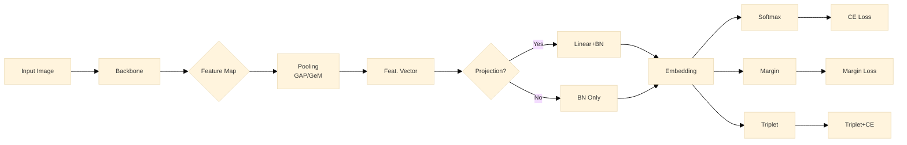

In the task of animal Re-IDentification (ReID), a substantial body of literature relies on deep descriptors, which represent an image as a feature vector produced by a neural network optimized for visual similarity. A major challenge in this domain is the limited availability of high-quality labeled images for the target species. This scarcity makes it difficult to train robust models from scratch. At the same time, most existing re-identification models have been developed primarily for person or vehicle re-identification. Although these tasks share methodological similarities with animal re-identification, models trained in those domains often require fine-tuning or adaptation to perform effectively on wildlife datasets. A recent and increasingly popular strategy is to leverage large publicly available foundation models that have been pre-trained on massive datasets for a wide range of computer vision tasks (e.g., DINO or DINOv3). These models can serve as powerful feature extraction backbones, enabling strong performance even with limited domain-specific data.

In this project, we aim to build a robust pipeline for the Kaggle Jaguar Re-Identification Challenge and evaluate the impact of different pretrained backbones on overall performance.

The model used throughout our experiments is implemented in `src/jaguar/models/jaguarid_models.py` and defined by the class `JaguarIDModel`. The model is initialized with the following parameters:

- `backbone_name` 
  Specifies the pretrained backbone architecture. Backbones are loaded through the `timm` library and registered in `src/jaguar/models/foundation_models.py`.
- `num_classes`
  Since the challenge operates in a closed-set identification setting, this parameter is always set to the number of identities present in the training data (31 jaguars).
- `head_type`
  Determines the head architecture placed on top of the pretrained backbone. Different heads correspond to different loss functions used during training. The losses we extensively ablate include:
  - Cross Entropy (standard baseline for classification tasks)
  - **ArcFace** (commonly used baseline in the Kaggle challenge)
  - **CosFace** and **SphereFace** (variants of margin-based metric learning losses)
  - **Triplet Loss**, combined with either **Cross Entropy** or **Focal Loss**
- `emb_dim`
  The dimensionality of the intermediate embedding produced by the head, which maps backbone features into the embedding space used for re-identification.
- `freeze_backbone`
  Boolean flag (default: `False`) controlling whether the backbone weights are frozen or fine-tuned during training.
- `loss_s` and `loss_m` 
  Scale and margin hyperparameters used in margin-based losses such as **ArcFace** and **Triplet Loss**.
- `use_gem` 
  Enables **Generalized Mean Pooling (GeM)** instead of the default max pooling layer.
- `use_projection` and `use_forward_features`  
  These flags determine how features are extracted from the backbone:
  - `use_projection`: uses the backbone output and maps it through a learnable projection layer.
  - `use_forward_features`: extracts features directly via the `forward_features` method provided by `timm`.

Only one of these options is enabled at a time.

- `mining_type`
  Defines the mining strategy used in Triplet Loss-based training, specifying how positive and negative pairs are selected.

- `label_smooth`
  Applies label smoothing to Cross Entropy losses to reduce overfitting and improve generalization during training.

The full Re-ID pipeline implemented in our codebase is summarized in the diagram below. Most of the ablation experiments performed during benchmarking are conducted with respect to this modular architecture, where we systematically vary backbone models, pooling strategies, embedding projections, and loss functions.

Hence, in this first experiment we aim to answer the following **Research Question**: *How do different pretrained backbones perform when integrated into a species-specific re-identification pipeline? In particular, which backbone achieves the best performance for the jaguar re-identification task?*

The backbones that we ablate are the following:
1. EVA-02: 
A transformer-based vision model trained using masked image modeling to learn strong and robust language-aligned visual representations. EVA models are designed to scale large self-supervised pretraining for vision tasks.
2. MegaDescriptor-L-384:  
A state-of-the-art foundational model for animal re-identification, explicitly trained and evaluated on curated multi-species wildlife datasets. It is widely considered a strong baseline for wildlife Re-ID tasks.
3. MiewID: 
A multi-species animal re-identification model based on an EfficientNet-B2 backbone, trained on curated wildlife datasets and designed to reach performance comparable to MegaDescriptor on several benchmarks.
4. DINO-Small: 
A self-supervised Vision Transformer trained with knowledge distillation using the DINO framework. The Small variant refers to a smaller transformer architecture with fewer parameters and embedding dimensions than the Base or Large variants.
5. DINOv2-Base: 
A large-scale self-supervised vision model trained on massive curated datasets. The Base variant corresponds to a mid-sized Vision Transformer architecture with higher capacity than Small models but lower computational cost than Large variants.
6. ConvNeXt-V2: 
An improved version of ConvNeXt that combines modern convolutional design with self-supervised learning techniques, providing competitive performance with transformer-based models.
7. EfficientNet-B4: 
A convolutional neural network designed using compound scaling to balance network depth, width, and resolution, providing strong performance on image classification and visual recognition tasks.
8. Swin-Transformer: 
A hierarchical Vision Transformer architecture that computes attention locally using shifted, non-overlapping windows, enabling efficient modeling of high-resolution images.

The selected backbones cover a diverse spectrum of architectural paradigms, including:

- Vision Transformers (EVA, DINO, DINOv2, Swin)
- Specialized Animal Re-ID Models (MegaDescriptor, MiewID)
- Modern Convolutional Networks (ConvNeXt, EfficientNet)

In addition to architectural diversity, these models also differ significantly in their pretraining strategies and training data, including:

- Self-supervised learning on large-scale image collections (e.g., DINO, DINOv2), where models learn representations by enforcing consistency between augmented views of images without labels
- Masked image modeling approaches (e.g., EVA), where models learn to reconstruct missing parts of images
- Supervised training on general-purpose vision datasets (e.g., EfficientNet, Swin)
- Task-specific training on curated wildlife re-identification datasets (e.g., MegaDescriptor, MiewID)

This combination of architectural and training diversity allows us to systematically analyze how general-purpose foundation models compare against models specifically designed for wildlife re-identification, when integrated into the same training and evaluation pipeline for the jaguar re-identification task.

For additional details on the architectures and training schemes, we refer the reader to the respective reference papers for each model.

To compare the different backbones, we follow a standardized training and evaluation procedure based on the configuration that previously achieved the highest score on the Kaggle leaderboard. The baseline configuration used in this experiment corresponds to the best-performing plug-and-play setup, which achieved ~90.1% mAP (+3%) (with the EVA backbone). The performance gain was largely due to the improved data split obtained during the EDA experiments (<insert link here>).

One example of such hyperparameter tuning is the **embedding dimension**: while originally tested with 512, we found that increasing it to **1024** yielded the best performance on the test set, whereas further increases did not lead to measurable gains.

In this split, the top 3 bursts for each identity are selected for the training set, while the remaining top 3 bursts are assigned to the validation set. This strategy ensures that the model sees sufficient visual variability for each jaguar while preventing overfitting to near-duplicate images from the same burst. The resulting validation set corresponds to roughly 20% of the training data (~370 images).

The backbone ablation presented here is performed on the Round 2 dataset, which contains images with masked backgrounds released for the Second Jaguar Re-ID Challenge in order to reduce spurious correlations with the environment.

The training setup is fixed across all backbone experiments.
- Loss function
  We use Triplet Loss with margin 0.7 (see detailed ablation here: <insert link>).  
  The hard mining strategy selects the *hardest positive* (most dissimilar image of the same identity) and the *hardest negative* (most similar image of a different identity) within the batch, encouraging the model to focus on the most challenging examples during training.

- Batch sampling
  We employ a `BalancedSampler`, ensuring that each batch of the set 32 contains 4 images per identity so that valid positive and negative pairs can be formed for triplet-based learning.

- Optimizer  
  The optimizer used is Adam, with an initial learning rate of 1e-5.

- Learning rate scheduler  
  We use a custom `JaguarIdScheduler`, adapted from the MiewID training pipeline.  
  The scheduler implements a three-stage schedule:
  1. Linear warm-up: the learning rate increases gradually from `lr_start` to `lr_max` during the first `lr_ramp_ep` epochs.  
  2. Sustain phase: the learning rate is kept constant at `lr_max` for a short period.  
  3. Exponential decay: the learning rate progressively decreases towards `lr_min` using a decay factor (`lr_decay`).
  This schedule stabilizes early training while enabling fine-grained adaptation in later epochs.

All models are initially trained with frozen backbone weights. After 5 epochs, we unfreeze the last two layers or blocks of the backbone (depending on its internal structure) and continue training with:

- learning rate: 2e-6
- weight decay: 1e-3

This approach allows the pretrained representations to remain stable while enabling limited task-specific adaptation for the jaguar dataset.

We apply a carefully designed augmentation suite evaluated in a dedicated experiment (<insert link here>):

- Horizontal flips (despite jaguars having asymmetric flank patterns, this improves generalization)
- Small geometric rotations / translations
- Mild color jitter to account for lighting variation and occlusions from camera traps
- Random erasing (p = 0.25)

We deliberately exclude Gaussian blur and random resize cropping, which were found to degrade performance in our ablation studies.

All experiments use a fixed random seed of 42 (except in the stability and model soup sensitivity experiments, see <insert link>).

Although training runs for 30 epochs and the prediliged metric is the Idenity mAP, we monitor Pairwise Average Precision (Pairwise AP) during validation, given that during runs on the round_1 data, it was evident that more trianing dat were needed at the expenses of images in the validation set, causing the mAP to massively drop if one identity had only one correpsonding image which was missed by the model

- **Pairwise AP** evaluates performance on **individual image-to-image pairs**.
- **Identity mAP**, used in the Kaggle evaluation, measures retrieval performance across **all identities**, averaging precision across the ranked retrieval lists for each query.

To avoid selecting unstable checkpoints, we early stop if Pairwise AP does not improve for 5 consecutive epochs.

All other hyperparameters are defined in `configs/kaggle/base_config` and are consistently loaded and overridden for each experiment via `experiments/experiment_runner.py`.

Special Considerations for CNN Backbones: Although the backbone ablation aims to keep training conditions identical across all models, preliminary experiments revealed that ConvNeXt-v2 and EfficientNet-B4 performed significantly worse than the other backbones when trained with the standard configuration using ArcFace loss.

To obtain more competitive and comparable results, we introduced several adjustments specifically for these purely convolutional architectures. Unlike Vision Transformers, CNNs rely primarily on local feature extractors and lack global attention mechanisms, which can limit their ability to capture long-range spatial dependencies relevant for animal re-identification.

To mitigate this limitation, we applied the following modifications:

- Random Resize Cropping was enabled in the augmentation pipeline to increase spatial variability and improve robustness to local feature shifts.
- The ArcFace margin was increased to encourage greater separation between identity clusters in the embedding space. CNN-based models often exhibit lower intra-class variation during training, quickly driving the training loss close to zero. At this stage, they tend to spread embeddings in the feature space and start fitting noisy labels, leading to overfitting.
- The entire backbone was unfrozen earlier (after 3 epochs) and fully fine-tuned to allow stronger adaptation to the jaguar dataset.

These adjustments help compensate for the absence of global attention mechanisms and the fact that these models were not pretrained on animal re-identification datasets**, unlike some of the other backbones considered in this study.

Model evaluation is performed using a lightweight ReID evaluation bundle (`ReIDEvalBundle`) that computes retrieval and embedding-quality metrics directly from the learned embeddings. The primary metric is the identity-balanced mean Average Precision (mAP), which evaluates retrieval performance for each identity and averages the resulting AP scores across identities, ensuring that identities with more images do not dominate the metric. In addition, we monitor Pairwise Average Precision (pairwise AP), which treats every pair of images as a binary classification problem (same identity vs different identity) and provides a complementary view of how well the embedding space separates identities. Standard ReID retrieval metrics such as Rank-1 and Rank-5 accuracy are also computed, measuring whether the correct identity appears among the top retrieved matches.

To further analyze the embedding space, the bundle includes ranking-quality metrics (e.g., Normalized Discounted Cumulative Gain (nDCG) which evaluates the quality of the ranking by giving higher weight to correct identities appearing at the top of the retrieval list), retrieval diagnostics (Recall@K, the proportion of queries for which the correct identity appears within the top K retrieved results), and embedding-space diagnostics such as the similarity gap, intra- vs inter-class distance, and optionally the Silhouette score, which measures clustering quality of identity embeddings. All metrics are computed from a cached cosine similarity matrix between embeddings to ensure efficient and consistent evaluation across experiments.

While Kaggle evaluates submissions using identity-level mAP on the test set, our internal validation additionally monitors pairwise AP and embedding diagnostics to detect overfitting and analyze the structure of the learned embedding space during training.

< insert here wandb screenshot >
< insert here wandb screenshot grouped >

Based on the experimental results shown in the Weights & Biases dashboard, a clear hierarchy emerges among the architectures:

- EVA-02 (dark blue dashed line) and MegaDescriptor-L-384 (purple dotted line) are the top performers. Both consistently outperform the others across all metrics, reaching a validation mAP above 0.7 and Rank-1 accuracy exceeding 94%. This confirms that massive-scale masked image modeling (EVA-02) and domain-specific pretraining on wildlife (MegaDescriptor) provide the most robust starting features for jaguar identification.

- DINOv2-Base (purple solid line) follows closely behind the leaders. Its strong performance demonstrates the effectiveness of self-supervised distillation on large datasets for fine-grained animal recognition tasks.

- MiewID (magenta line) and Swin-Transformer (dark green line) show competitive results. MiewID, despite being specialized for animal Re-ID, is limited by its EfficientNet-B2 backbone compared to larger Transformer-based foundational models trained with Triplet Loss. Conversely, when trained with the stable ArcFace loss and head (refer to previous runs in the project workspace on Weights & Biases), MiewID and Swin-Transformer reached performance comparable to EVA-02. The configuration reported here achieved the highest identity mAP on the test set.

- EfficientNet-B4 (light blue) and ConvNeXt-V2 (orange) exhibit the lowest performance despite the specialized adjustments (increased margin, earlier unfreezing, and Random Resize Cropping). This suggests that global attention mechanisms in Transformers are more effective at capturing the subtle, spatially distributed flank patterns of jaguars than the local receptive fields of traditional CNNs. Notably, in round_1 of the challenge (refer to previous runs in Weights & Biases), these results were less clear when images included the background, highlighting that global attention can be affected by distracting elements or jaguar pose in the image patches. For simplicity, comparisons with round_1 are omitted here, but it is important to note that background context can interfere with Transformer attention in this task.

The diagnostic metrics provide deeper insight into why certain models perform better:
- In the val/silhouette plot, EVA-02 shows a significantly higher silhouette score (~0.5) compared to the others. This indicates that EVA-02 creates much tighter clusters for individual jaguars, creating clearer boundaries between different identities.
- The val/sim_gap (Similarity Gap) plot shows that EVA-02 and MegaDescriptor-L maintain the largest margin between intra-class similarity and inter-class similarity. This explains their superior performance in Triplet Loss training, as they provide a cleaner feature space for the hard-mining strategy to operate within.
- The val/loss plot reveals that the Top Tier models (EVA-02, MegaDescriptor) achieve the lowest validation loss and reach stability faster than the CNN counterparts.
- The val/pairwise_AP trend mirrors the mAP results but shows smoother improvement. It is worth noting that while most models start at a similar baseline (around epoch 0), the foundational Transformers exhibit a much steeper "learning curve" in the first 10 epochs, likely due to the high quality of their frozen representations.

The results highlight that general-purpose foundation models can match or exceed specialized wildlife models. EVA-02, which was not specifically trained on animals, slightly edges out MegaDescriptor-L, which was curated specifically for wildlife Re-ID. This suggests that the scale and diversity of pretraining in modern foundation models (like EVA and DINOv2) result in "universal" visual features that are highly transferable to niche domains like jaguar identification.

Recommendation for the pipeline: Moving forward, EVA-02 is used as the default backbone to achieve 90%+ target observed on the leaderboard. 
