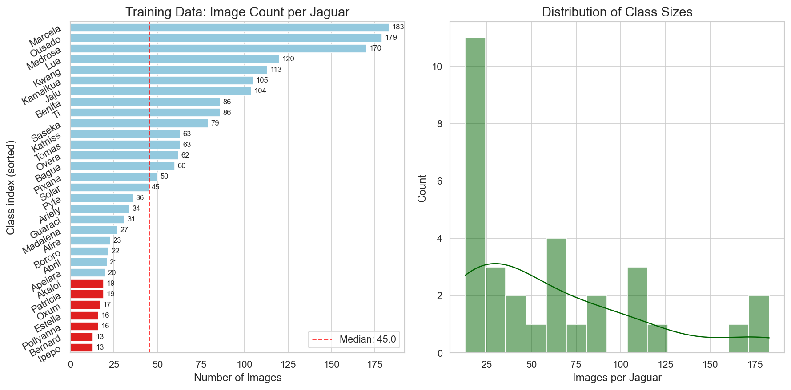
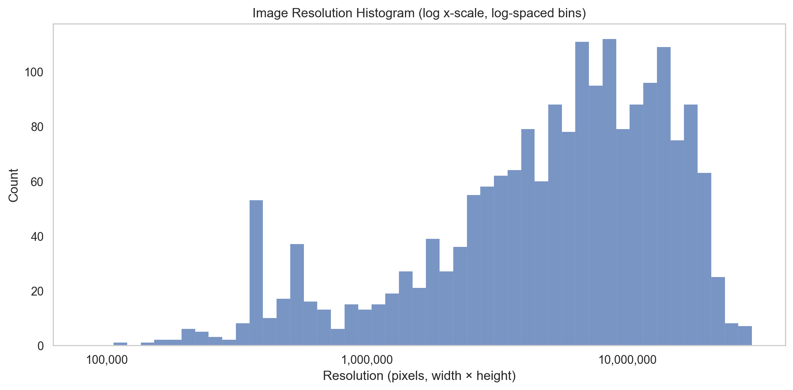
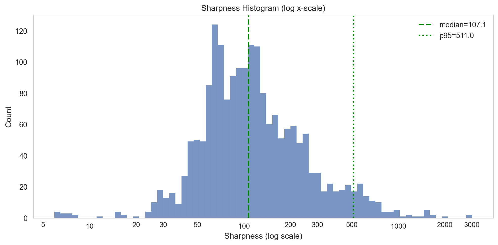
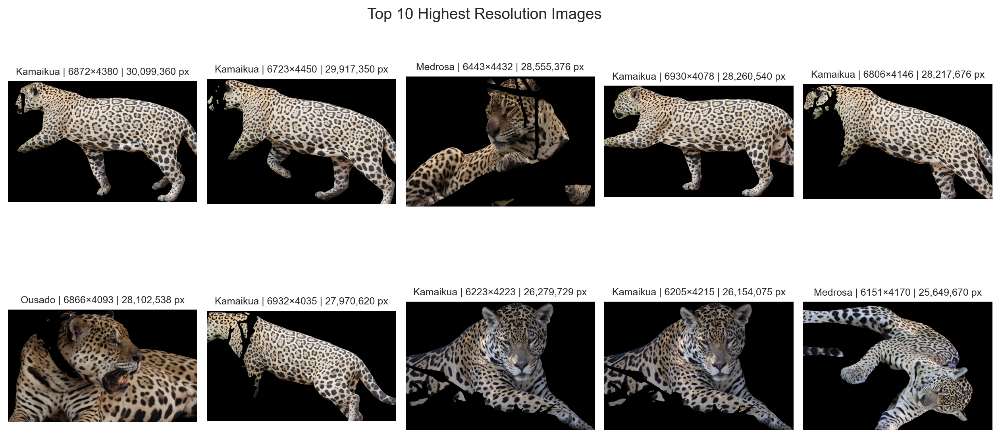
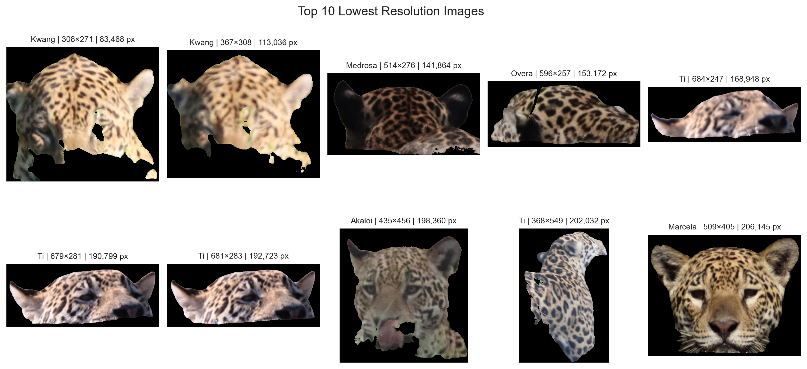
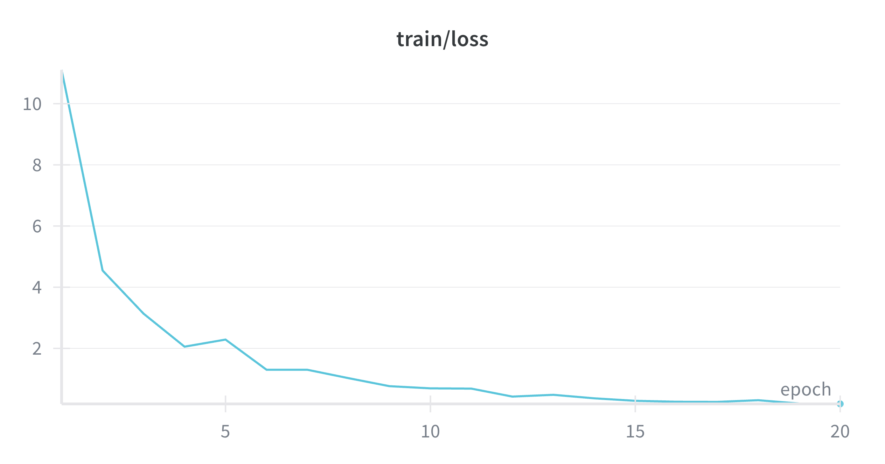
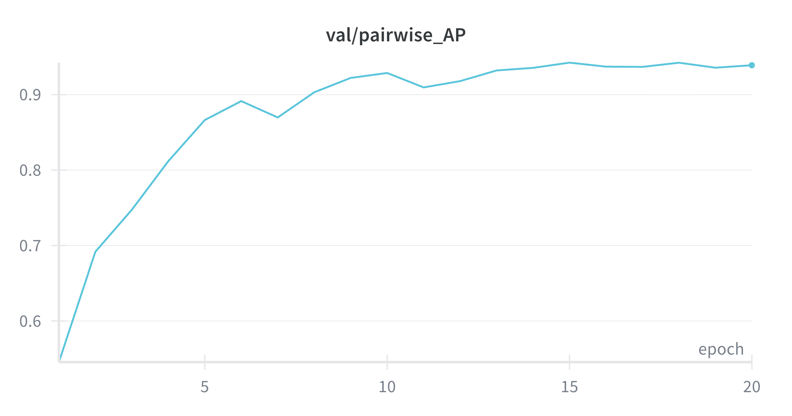
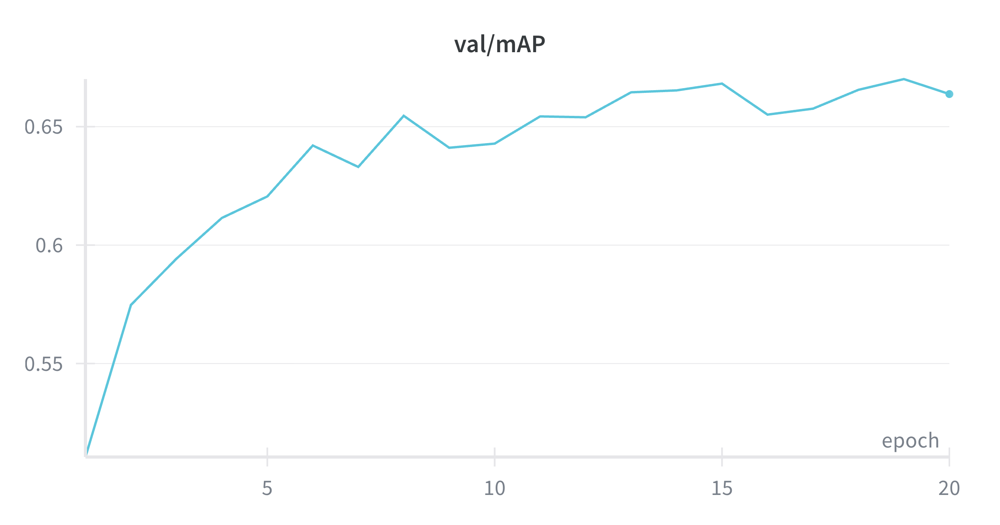
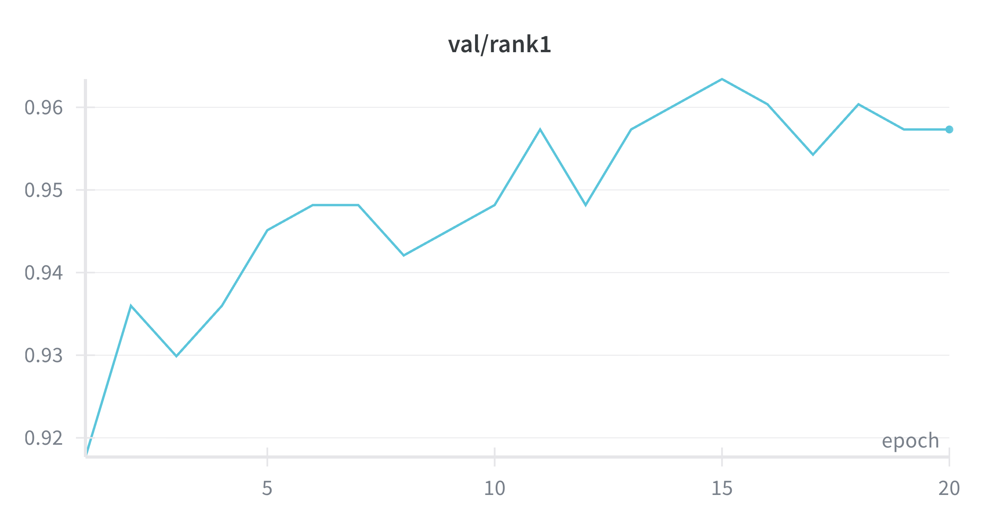
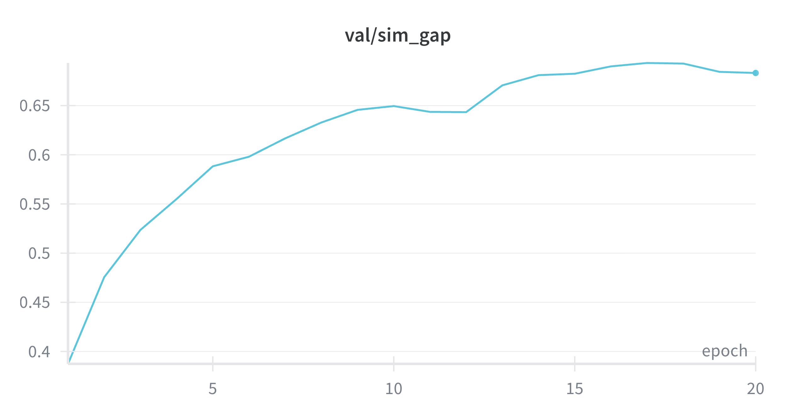

# E01 - Initial baseline and EDA summary (Data - Round 2)

This initial baseline experiment establishes the starting point for all later analyses on the **Round 2** jaguar dataset. A key property of this round is that the images are no longer natural photographs with background context, but **foreground cutouts**. This matters because it changes what the model can rely on: any future performance differences should primarily be interpreted through **jaguar appearance, crop quality, pose, and image quality**, rather than scene context.

## Background Information
--------------------------------------------------------
The first finding is that after running a vorsorglichen? check the **background information is indeed absent for all images**. The dataset consists entirely of **cutout images with missing background**, so background-based cues are not available in this round. 
In addition, the "empty" area is substantial: the median `alpha0_frac` is **0.533**, indicating that for a typical image, just over half of the canvas consists of transparent non-foreground area. 

| Statistic | `alpha0_frac` |
|---|---:|
| Mean | 0.5392 |
| Median | 0.5329 |
| Min | 0.0711 |
| Max | 0.8716 |
| Std | 0.1185 |

The summary statistics in **Table 1** show that `alpha0_frac` spans a wide range (approximately **0.07 to 0.87**), indicating substantial variation in jaguar occupancy across images: some cutouts fill most of the frame, whereas others occupy only a relatively small portion of the canvas and leave a large transparent area.

the median `alpha0\_frac` is roughly **0.53**, meaning that for a typical image, a little over half of the canvas is non-foreground. Overall, although background is removed, the images still vary a lot in how much of the frame is occupied by the jaguar itself.

## Identity distribution
---------------------

<em>Identity distribution.</em>

The identity distribution is clearly **long-tailed and imbalanced**. The training set contains **31 identities and 1,895 images** in total. Class sizes range from **13 to 183 images per identity**, with a **median of 45** images and a **mean of about 61**. This means a few jaguars are heavily represented, while several identities have only limited data.

This imbalance is important for the baseline because it can bias both training and evaluation:
*   identities with many samples are easier for the model to learn robustly,
*   low-sample identities are more vulnerable to underfitting and unstable retrieval behavior,
*   performance differences later on may partly reflect data availability rather than only model quality.

A useful practical observation is that applying a minimum threshold of **20 images per identity** would retain **24 identities and 1,782 images**, while removing **7 identities and 113 images**. So the severe low-shot tail is relatively small in sample count, but still important in class count.

## Image dimensions and resolution
-------------------------------

  
  

  <em>Left: Resolution distribution. Right: Sharpness distribution.</em>

The dataset shows **strong variability in image dimensions and resolution**. Widths are generally larger than heights, which is expected because many jaguar cutouts are side views or horizontally stretched body crops. Most images are in the **multi-megapixel range**, but the resolution histogram also reveals a noticeable tail of **very small images**.

This variation is relevant because it introduces a second source of heterogeneity:
*   high-resolution images preserve fine coat pattern detail, which is crucial for re-identification,  
*   low-resolution images lose discriminative spot structure,
*   different effective scales may make training less stable unless preprocessing is consistent.
    

Sharpness is also heterogeneous. The distribution is broad, with a **median sharpness of about 107.1** and a **95th percentile of about 511.0**. This suggests a mixture of image acquisition conditions, ranging from softer and noisier images that are consistent with camera-trap captures or casual tourist photographs to a smaller subset of exceptionally sharp images that likely reflect higher-quality cameras and more favorable shooting conditions.

For the baseline, this matters because coat patterns are highly texture-dependent. Blurry images are likely to reduce identity separability, while sharper images should be much easier for the model. So sharpness is a likely contributor to both per-identity and per-sample performance differences.

## Qualitative quality extremes
----------------------------

  
  

  <em>Left: Top10 highest image resolution. Right: Top10 lowest image resolution.</em>

The qualitative examples support the quantitative picture. The **highest-resolution images** preserve much more visible coat detail, although some are still partial or imperfect cutouts. The **lowest-resolution examples** are much more problematic: several are tiny, strongly cropped, partially visible, or visually degraded. These low-quality edge cases are likely to be challenging for any retrieval model and should be expected to contribute disproportionately to failure cases.

## Main takeaway
-------------

Overall, the Round 2 baseline dataset is best characterized as a **foreground-only, identity-imbalanced, and image-quality-heterogeneous** re-identification setting. The most important findings at this stage are:

*   **No usable background context remains**; Round 2 is effectively a jaguar-only setting. 
*   The dataset has a **long-tailed identity distribution**, with a few well-covered identities and several low-sample ones.
*   There is **large variation in resolution, crop extent, and sharpness**, which likely affects retrieval difficulty.
*   Some very low-quality cutouts exist and should be treated as likely hard cases in later analyses.
    

This makes the initial baseline especially valuable: it provides a clean starting point for later experiments by showing that performance differences in Round 2 should mainly be interpreted through **foreground identity cues and image quality factors**, not background reliance.

## Baseline training and validation performance
-------------

The baseline model shows a stable and effective training trajectory. Training loss decreases sharply over the first epochs and continues to decline steadily, indicating good optimization behavior without obvious instability. At the same time, validation performance improves consistently: **mAP** rises from roughly **0.51** to about **0.66–0.67**, **pairwise AP** from about **0.55** to **0.94**, **Rank-1** from about **0.92** to around **0.96**, and the **similarity gap** from about **0.39** to **0.68**. Overall, these curves suggest that the baseline already learns strong identity-discriminative embeddings on Round 2 and provides a solid reference point for later experiments.

  
  
  
  
  

  <em>From left to right: training_loss, validation pairwise AP, validation mAP, validation Rank-1, and validation similarity gap across training epochs.</em>

