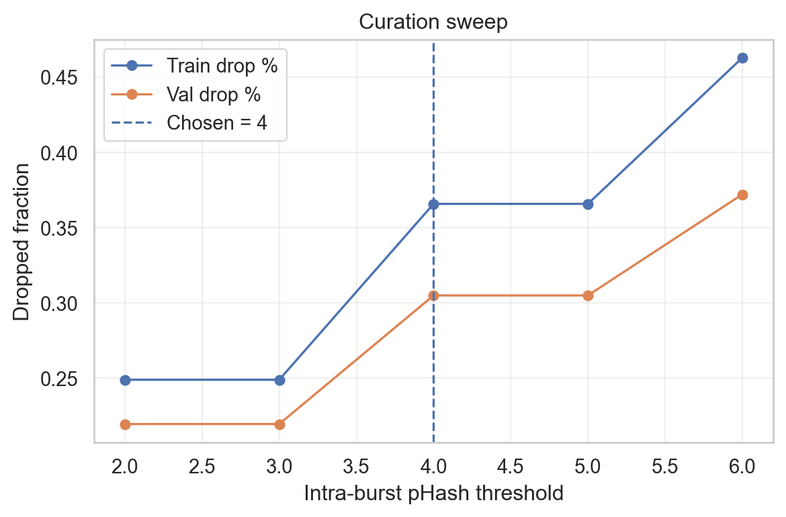
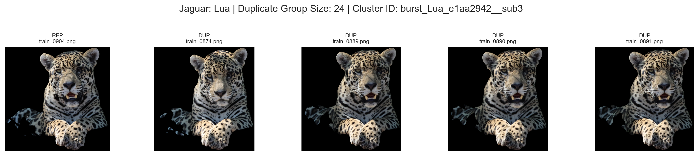
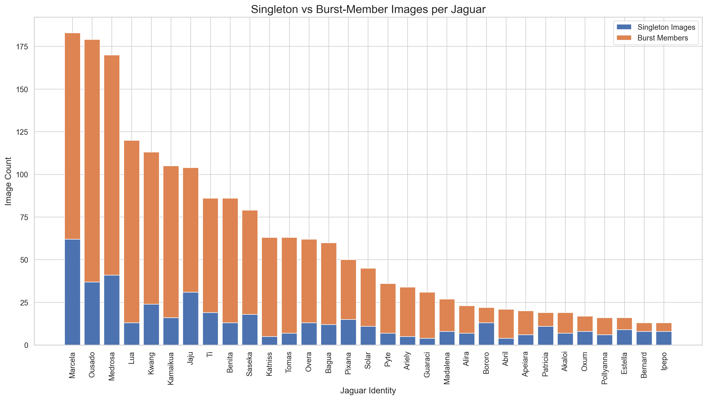
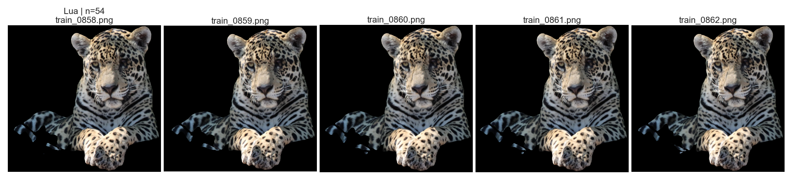

# E02 Kaggle Deduplication (Data - Round 2)

**Experiment Group:** Interpretability analyses

## Main Research Question
----------------------

How should near-duplicate and burst redundancy be identified, controlled, and curated in the Jaguar dataset to obtain a leakage-safe evaluation setup and improve Jaguar Re-ID performance?

## Stage 1 — Burst Discovery / Near-Duplicate Annotation
-----------------------------------------------------

### Research Question

To what extent does the Jaguar dataset contain burst-like and near-duplicate redundancy, and how can this redundancy be characterized quantitatively and structurally?

### Intervention

Burst discovery via pHash-based candidate generation, conservative thresholding, and connected-component grouping.

### Method / Procedure

To identify burst-like redundancy, perceptual hashes (pHash) were first computed for all images and compared within identity only. This provides a fast and conservative signal for very close visual similarity while avoiding unsafe links between different individuals at the candidate-generation stage.The pHash threshold was then selected using within-identity versus cross-identity diagnostics: the final cutoff was chosen as the largest threshold that still avoided cross-identity collisions.

After thresholding, retained pairs were converted into a graph and grouped via connected components. This is important because burst redundancy is often transitive: if image A matches B and B matches C, all three may belong to the same burst even when A and C are not the strongest direct pair.

pHash was used first because it is efficient, deterministic, and specific to near-duplicate visual structure. By contrast, embedding similarity was not used in isolation for the initial threshold because it is more semantic and therefore less specific to true duplicate bursts. Used too early, it can over-link images that share identity, pose, or background without originating from the same burst event. For this reason, similarity is better suited as a later refinement signal than as the primary criterion for initial burst discovery.

### Evaluation

The threshold diagnostics show a clear safety boundary. Within-identity links increase steadily as the pHash threshold becomes more permissive, but cross-identity collisions remain at zero up to threshold 11 and first appear at threshold 12. This makes threshold 11 a natural operating point: it is the most permissive setting that still remains collision-free in the diagnostic sample, while already capturing a substantial amount of within-identity redundancy.

Structurally, the detected redundancy is not limited to isolated pairs but forms sizable burst groups. The example cluster for **Lua** illustrates this well: many images are near-identical apart from tiny local changes, confirming that connected-component grouping is necessary rather than pairwise filtering alone. The larger top-burst visualization further shows that some bursts contain long runs of almost repeated frames, exactly the kind of redundancy that would otherwise create train/validation leakage and artificially simplify retrieval.

At dataset level, burst redundancy is widespread rather than exceptional. A large majority of images belong to burst groups, and the per-identity distribution is highly uneven: some jaguars are dominated by burst members, while others contain a larger singleton share. This matters because leakage risk and duplicate inflation are therefore not uniform across identities. A duplicate-aware protocol is not only needed globally, but also has to be robust to this identity-level heterogeneity.

<em>pHash threshold diagnostics.</em>

<em>example duplicate group (Lua).</em>

<em>burst-member vs singleton counts per jaguar here.</em>

<em>top burst example strip.</em>

### Key Result / Takeaway

Burst redundancy is both **substantial and structured** in the dataset. The threshold sweep identifies **pHash ≤ 11** as the largest conservative cutoff before sampled cross-identity collisions appear, and the connected-component analysis confirms that redundancy often occurs as multi-image burst groups rather than isolated duplicate pairs. This stage therefore establishes a defensible basis for leakage-safe grouping before split construction.

## Stage 2 — Split and Duplicate-Aware Curation
--------------------------------------------

### Research Question

Can leakage-safe train/validation splits be constructed by enforcing burst-level separation while optionally controlling redundancy within splits, without violating the intended evaluation protocol?

### Intervention

Burst-aware split construction with strict burst separation across train/validation and optional within-split duplicate-aware curation.

### Method / Procedure

Starting from the burst-annotated manifest, train/validation splits were defined under two possible policies: open-set (identities disjoint across splits) and closed-set (identities may appear in both splits, but burst groups remain disjoint). The project ultimately proceeded with the closed-set protocol, since this matched the Kaggle challenge.

To prevent leakage, splitting was done at burst-group level rather than image level. Each burst group was treated as one indivisible split unit, while non-burst images were treated as singleton units. These units were then assigned to train or validation with approximate identity stratification and mapped back to image rows. This ensures that no near-duplicate burst is split across train and validation.

After splitting, duplicate-aware curation could either be skipped or applied within each split. If duplicates were kept, all images remained in the final dataset. If curation was enabled, each burst was further partitioned into tighter duplicate subclusters using a stricter pHash threshold. This threshold was not fixed a priori; instead, a small sweep over candidate thresholds was used to measure how many images would be removed under each setting in train and validation. This made the redundancy–retention trade-off explicit and allowed selection of a threshold that reduced obvious duplicates without discarding too much data or creating a strong imbalance between splits.

Within each resulting subcluster, up to train\_k images were retained in training and up to val\_k in validation. These parameters control how much local redundancy is preserved per duplicate set. Representatives were selected using a simple ranking heuristic based on embedding centrality and image sharpness. A possible future refinement would be to prefer a more diverse subset rather than only the most central and sharpest images.

### Evaluation

The curation sweep makes the retention trade-off explicit. Very mild thresholds (pHash = 2 or 3) remove relatively little redundancy, dropping about **24.9%** of training images and **22.0%** of validation images. By contrast, stronger thresholds progressively reduce the dataset much more aggressively: at pHash = 4, the drop rises to about **36.6%** in train and **30.5%** in validation, while pHash = 6 removes nearly half of the training data and more than a third of the validation data.

The chosen setting, **intra-burst pHash = 4**, sits in the middle of this curve and appears to be a reasonable compromise. It is clearly more effective than the weak settings at removing redundant frames, but it does not yet collapse the dataset as severely as the strongest tested option. Importantly, the train and validation drop rates remain relatively close, so curation does not introduce a large asymmetry between splits.

The resulting split statistics also remain consistent with the intended protocol. All identities are preserved, the train/validation ratio stays broadly similar, and the per-identity histograms indicate that the closed-set setup still contains the same individuals on both sides while avoiding duplicate-group leakage. In other words, curation changes redundancy density, not the basic evaluation structure.

Overall, this stage shows that leakage-safe splitting and duplicate-aware curation can be combined without breaking the benchmark setup. The selected configuration reduces redundancy substantially, yet still preserves identity coverage and enough within-identity variation for meaningful retrieval evaluation.

**Suggested table / figure placeholders**

*   \[Insert Table: curation sweep summary here\]
    
*   \[Insert Figure: curation sweep plot here\]
    
*   \[Insert Figure: train vs val identity count histograms here\]
    

### Key Result / Takeaway

Burst-level split construction yields a **leakage-safe closed-set protocol**, and the intra-burst curation sweep shows that **pHash = 4** is a practical middle ground. It removes a meaningful share of redundant images while preserving all identities and a similar train/validation structure, making it a suitable setting for downstream controlled experiments.

Stage 3 — Experimentation
-------------------------

### Research Question

How does the degree of duplicate-aware curation within a fixed closed-set setup affect Jaguar Re-ID retrieval performance?

### Intervention

Controlled variation of curation strength through different train\_k / val\_k settings under otherwise fixed experimental conditions.

### Method / Procedure

This stage isolates the effect of duplicate-aware curation on retrieval performance. Burst annotations, split protocol, intra-burst subclustering threshold (pHash = 4), model, training, and evaluation remained fixed. Only the number of retained images per local duplicate subcluster was varied.

The experiment series included the full split (keep all) and several curated variants, ranging from aggressive deduplication (1/1) to more moderate and asymmetric settings (3/3, 3/1, 5/1, 8/1, 1/50).

### Evaluation

The results show a clear pattern: **moderate curation performs best**, whereas overly aggressive curation degrades retrieval.

The strongest overall configuration is **train\_k=3, val\_k=3**, which achieves the highest **id-balanced mAP (0.7049)**. Compared with the full split (**0.6788**), this is a gain of **+0.0261**. It also improves **pairwise AP** (**0.9574 vs. 0.9489**) and slightly improves **rank-1** (**0.9592 vs. 0.9573**), although **sim-gap** is slightly lower (**0.8487 vs. 0.8595**).

In contrast, **aggressive curation (1/1)** performs worst among the main variants, dropping to **0.6624 mAP** and **0.9386 rank-1**. This indicates that strong duplicate removal removes useful within-identity variation rather than only harmful redundancy.

The remaining variants support the same conclusion. **1/50** performs well on **pairwise AP** and **rank-1**, but remains below 3/3 on **id-balanced mAP**. Settings such as **3/1**, **5/1**, and **8/1** do not provide a consistent improvement over the full split. Thus, the benefit does not come from maximal deduplication, but from reducing redundancy while still preserving several representative views per duplicate subcluster.

Importantly, these metrics should not be interpreted in isolation. In a burst-heavy dataset, retaining all near-duplicates can make retrieval artificially easier, especially when repeated views are overrepresented. Higher raw scores under less curated settings are therefore not automatically evidence of better generalization; they may partly reflect benchmark redundancy. Duplicate-aware curation is relevant not only because it can improve performance, but also because it makes the evaluation more stringent and the resulting metrics more trustworthy.

Training curves are consistent with this interpretation. **Train loss is very similar across settings**, so differences are not explained by optimization instability. The main differences appear in the validation curves, where the moderate curated settings reach the strongest and most stable late-epoch plateau, especially for **mAP** and **pairwise AP**.

**Suggested table / figure placeholders**

*   \[Insert Table: stage-3 main comparison across all curation settings here\]
    
*   \[Insert Figure: stage-3 metrics overview here\]
    
*   \[Insert Figure: train loss comparison here\]
    

### Key Result / Takeaway

Duplicate-aware curation improves Jaguar Re-ID performance **when applied moderately**. The best overall setting is **train\_k=3, val\_k=3**, which gives the highest **id-balanced mAP** and improves the main retrieval metrics over the full split. More aggressive curation removes too much useful variation, while keeping all duplicates can make raw scores easier to achieve and therefore less reflective of true generalization.

Overall Conclusion
------------------

The deduplication study shows that burst redundancy is a meaningful property of the Jaguar dataset and must be handled explicitly to avoid leakage and overly optimistic evaluation.

A three-stage pipeline addresses this effectively:(1) conservative pHash-based burst discovery,(2) burst-aware split construction with optional within-split curation, and(3) controlled experiments on curation strength.

The main practical result is that **moderate duplicate-aware curation is preferable to both keeping all images and deduplicating too aggressively**. In this study, **train\_k=3, val\_k=3** provides the best overall trade-off between redundancy reduction and preservation of useful within-identity variation. This makes the dataset not only cleaner from an evaluation perspective, but also stronger for downstream Jaguar Re-ID.

_Overall, duplicate-aware curation should be treated as part of the dataset design, because moderate redundancy reduction improves both evaluation quality and retrieval performance._