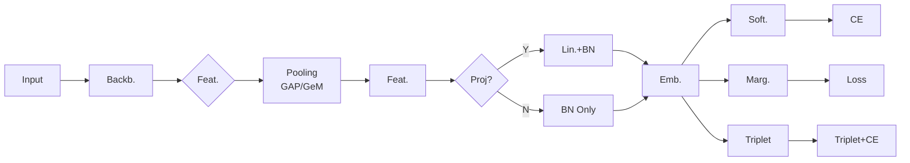

# Backbone Ablation (Data - Round 2)

**Experiment Group:** Backbone and training ablations

## Main Research Question

How do different pretrained backbones perform when integrated into the same jaguar-specific re-identification pipeline, and which backbone provides the strongest retrieval performance for the Kaggle Jaguar Re-Identification task?

## Motivation

In animal re-identification, images are typically represented by deep descriptors, i.e. feature vectors produced by a neural network optimized for visual similarity. A central challenge in this setting is the limited availability of high-quality labeled data for the target species. This makes it difficult to train robust models from scratch and increases the importance of transfer learning.

Many established re-identification models were originally developed for person or vehicle re-identification. Although these tasks are methodologically related to animal re-identification, models trained in those domains often require adaptation before they perform well on wildlife data. A more recent strategy is to use large pretrained foundation models as feature extraction backbones. These models, for example from the DINO or EVA families, are trained on massive image collections and can provide strong visual representations even when only limited target-domain data are available.

The goal of this experiment is therefore to compare a diverse set of pretrained backbones within one fixed Jaguar Re-ID pipeline and to identify which backbone transfers best to the masked-background jaguar benchmark.

## Model and Pipeline

The model used throughout these experiments is implemented in `src/jaguar/models/jaguarid_models.py` as `JaguarIDModel`. The architecture is modular and allows the backbone, feature extraction strategy, pooling, projection, and loss head to be varied within one common framework.

The main configurable components are:

- `backbone_name`: pretrained backbone architecture loaded through `timm` and registered in `src/jaguar/models/foundation_models.py`
- `num_classes`: number of jaguar identities in the closed-set training split (**31**)
- `head_type`: head architecture and associated loss family
- `emb_dim`: dimensionality of the learned embedding
- `freeze_backbone`: whether the pretrained backbone is frozen initially
- `loss_s`, `loss_m`: scale and margin parameters for margin-based losses
- `use_gem`: whether GeM pooling is used instead of the default pooling layer
- `use_projection`, `use_forward_features`: alternative feature extraction and projection modes
- `mining_type`: sampling/mining strategy for triplet-based training
- `label_smooth`: label smoothing for cross-entropy-based losses

The head variants used across the broader project include:

- Cross Entropy
- ArcFace
- CosFace
- SphereFace
- Triplet Loss combined with Cross Entropy or Focal Loss

The full Re-ID pipeline is summarized below.

Most benchmarking experiments are carried out within this modular design by varying the backbone while keeping the rest of the training and evaluation pipeline as consistent as possible.

## Backbone Families Under Comparison

We ablate the following pretrained backbones:

1. **EVA-02**  
   Transformer-based vision model trained with masked image modeling.
2. **MegaDescriptor-L-384**  
   Wildlife-focused foundation model explicitly designed for animal re-identification.
3. **MiewID**  
   Multi-species animal re-identification model based on an EfficientNet-B2 backbone.
4. **DINO-Small**  
   Smaller self-supervised Vision Transformer trained with DINO.
5. **DINOv2-Base**  
   Mid-sized self-supervised Vision Transformer trained on large curated datasets.
6. **ConvNeXt-V2**  
   Modern convolutional architecture with strong self-supervised pretraining.
7. **EfficientNet-B4**  
   Convolutional backbone based on compound scaling.
8. **Swin-Transformer**  
   Hierarchical Vision Transformer with shifted-window attention.

These models span three main categories:

- **Vision Transformers:** EVA, DINO, DINOv2, Swin
- **Specialized Animal Re-ID models:** MegaDescriptor, MiewID
- **Modern convolutional networks:** ConvNeXt, EfficientNet

They also differ in pretraining strategy, ranging from large-scale self-supervised learning and masked image modeling to supervised pretraining and wildlife-specific Re-ID training. This makes the comparison informative not only architecturally, but also in terms of how general-purpose foundation models compare against domain-specialized wildlife models inside the same downstream jaguar pipeline.

For architectural and pretraining details beyond the scope of this report, we refer to the original model papers.

## Experimental Setup

### Dataset and split

The backbone ablation is performed on the **Round 2** dataset, i.e. the masked-background version released for the second Jaguar Re-Identification Challenge in order to reduce spurious environmental correlations.

The train/validation split follows the duplicate-aware protocol developed earlier in the project. A **20% validation split** is created with class stratification. Images are then grouped by bursts and near-duplicate structure, sorted by resolution, and the top-`k` images from each group are retained in train and validation. This aims to preserve visual variability per jaguar while reducing redundancy and limiting overfitting to duplicates or low-quality frames.

### Fixed training configuration

To compare backbones as fairly as possible, the training setup is held fixed across the main backbone experiments.

- **Loss:** Triplet Loss with margin **0.7**
- **Mining:** hardest positive and hardest negative within the batch
- **Batch sampler:** balanced sampler with batch size **32** and **4 images per identity**
- **Optimizer:** Adam with initial learning rate **1e-5**
- **Scheduler:** `JaguarIdScheduler` with warm-up, sustain, and exponential decay phases

All models are first trained with frozen backbone weights. After **5 epochs**, the last two layers or blocks of the backbone are unfrozen and fine-tuned with:

- learning rate **2e-6**
- weight decay **1e-3**

This keeps the pretrained representation stable in early training while still allowing limited jaguar-specific adaptation later.

### Augmentation setup

The augmentation pipeline follows the strongest configuration identified in the dedicated augmentation study. It includes:

- horizontal flips
- small rotations and translations
- mild color jitter
- random erasing (`p = 0.25`)

Gaussian blur and random resized cropping were excluded from the default setup because earlier ablations indicated that they reduced performance.

### Checkpoint selection and validation monitoring

All experiments use random seed **42** except for dedicated stability and sensitivity analyses elsewhere in the project.

Training runs for **30 epochs**. Although Kaggle evaluates models with identity-level mAP, internal checkpoint selection monitors **pairwise AP** during validation. This was motivated by observations on Round 1: when more data were shifted into training and the validation set became smaller, identity-level mAP became unstable because a missed query could disproportionately affect identities with very few valid positives.

- **Pairwise AP** evaluates image-to-image matching quality
- **Identity mAP** evaluates retrieval quality across ranked lists and averages AP across identities

To avoid unstable checkpoint selection, training is early-stopped if pairwise AP does not improve for **5 consecutive epochs**.

All remaining hyperparameters are defined in `configs/kaggle/base_config` and loaded via `experiments/experiment_runner.py`.

## Special Considerations for CNN Backbones

Although the backbone ablation is designed to keep training conditions as similar as possible, preliminary experiments showed that **ConvNeXt-V2** and **EfficientNet-B4** performed substantially worse under the standard setup.

To obtain more competitive and comparable CNN results, three adjustments were introduced specifically for these architectures:

- **Random resized cropping** was enabled to increase spatial variability
- the **ArcFace margin** was increased to encourage stronger cluster separation
- the **entire backbone** was unfrozen earlier, after **3 epochs**, to allow stronger task-specific adaptation

The rationale was that these purely convolutional models rely primarily on local receptive fields and do not have the same global attention mechanisms as transformer backbones. These modifications were intended to partly compensate for that limitation and for the fact that the CNNs considered here were not pretrained specifically for wildlife re-identification.

## Evaluation

Model evaluation is based on a lightweight `ReIDEvalBundle`, which computes retrieval and embedding-quality metrics directly from the learned embeddings. The primary metric is **identity-balanced mAP**, which averages AP across identities so that jaguars with more images do not dominate the score.

We additionally monitor:

- **pairwise AP**
- **Rank-1** and **Rank-5** retrieval accuracy
- **nDCG**
- **Recall@K**
- **similarity gap**
- **intra- vs inter-class distance**
- optionally **silhouette score**

All metrics are derived from a cached cosine-similarity matrix to ensure efficient and consistent evaluation across runs.

While Kaggle evaluates submissions with identity-level mAP on the hidden test set, these internal validation metrics are useful for monitoring overfitting and for understanding the structure of the learned embedding space.

## Main Results

The Weights & Biases curves show a clear performance hierarchy across the backbone families.

<em>Figure 1. Validation metrics across epochs for the different pretrained backbones.</em>

Two models form the top tier: **EVA-02** and **MegaDescriptor-L-384**. Across the displayed validation metrics, both outperform the remaining backbones and reach the strongest final retrieval quality. In the curves shown here, both exceed roughly **0.7 validation sim-gap**, **0.5 silhouette**, **0.8 pairwise AP**, and **0.94 Rank-1**, with the strongest validation mAP trajectories among all compared models.

The next tier consists of **DINOv2-Base** and **MiewID**, which remain competitive but do not match the two strongest backbones under this configuration. **Swin-Transformer** achieves clearly lower validation performance across the main retrieval metrics in the displayed setup.

At the bottom of the comparison are **EfficientNet-B4** and **ConvNeXt-V2**. Even with the additional CNN-specific adjustments, both remain behind the transformer-based and wildlife-specialized top performers.

### Validation-metric interpretation

The diagnostic metrics help explain these differences.

- In the **validation silhouette** plot, **EVA-02** achieves the highest score, indicating tighter identity clusters and clearer separation between jaguars.
- In **validation sim-gap**, **EVA-02** and **MegaDescriptor-L** maintain the largest separation between intra-class and inter-class similarity, which is consistent with their strong retrieval performance.
- The **validation loss** curves show that the top-performing backbones also converge to lower and more stable validation loss values than the weaker CNN baselines.
- The **pairwise AP** plot broadly mirrors the mAP ranking, but evolves more smoothly over epochs, which is why it is useful for checkpoint selection.

Overall, the trends suggest that strong backbones do not merely improve one retrieval metric in isolation. Rather, they produce a more structured embedding space, which is reflected jointly in mAP, pairwise AP, sim-gap, silhouette, and validation loss.

### Training-loss comparison

The train-loss curves provide a complementary view of optimization behavior.

<em>Figure 2. Training loss across epochs for the different pretrained backbones.</em>

Most backbones show the expected rapid drop in loss during the first epochs, followed by a flatter late-training regime. However, the trajectories differ markedly in level and stability. **EVA-02** and **MegaDescriptor-L** reach very low final train loss while also maintaining the strongest validation metrics, suggesting that their good validation performance is not simply a consequence of unstable optimization. By contrast, **Swin-Transformer** remains at a much higher training-loss plateau and also underperforms in validation, which indicates weaker fitting under this setup rather than better regularization.

### Architectural interpretation

A notable result of this experiment is that large general-purpose foundation models can match or exceed specialized wildlife models. **EVA-02**, despite not being trained specifically for animal re-identification, performs at least on par with and in several diagnostics slightly ahead of **MegaDescriptor-L-384**, which was explicitly developed for wildlife Re-ID.

This suggests that large-scale pretraining and representation quality can transfer extremely well to jaguar identification, even without species-specific supervision during pretraining.

At the same time, the results also indicate that architecture matters. The strongest models in this experiment are transformer-based or wildlife-specialized descriptors with very strong pretrained representations. The weaker CNN results suggest that local convolutional features alone may be less effective for capturing the subtle, spatially distributed flank-pattern cues required for jaguar identification, at least under the present training setup.

The project notes also indicate that this ranking was less clear on **Round 1**, where backgrounds were still present. That observation should be interpreted cautiously, but it is compatible with the idea that background context can interact with global attention and partly obscure the underlying backbone comparison.

## Practical Implication

From a competition perspective, **EVA-02** is the strongest default backbone choice for the pipeline and is therefore used as the main backbone in later experiments. The reason is straightforward: under the standardized Round 2 setup, it delivers the strongest overall validation profile across mAP, Rank-1, similarity gap, silhouette, and loss dynamics.

At the same time, **MegaDescriptor-L-384** emerges as a highly competitive alternative. It remains very close to EVA-02 in the main retrieval metrics and is especially interesting because it combines strong wildlife-specific pretraining with strong downstream transfer to the jaguar benchmark.

## Limitation

This experiment isolates backbone choice within one shared training pipeline, but it does not fully separate architecture from all backbone-specific tuning effects. In particular, the CNN backbones required additional adjustments to remain reasonably competitive, which means the comparison is standardized but not perfectly identical in every detail.

In addition, the results are internal validation results on the Round 2 masked-background benchmark. They are highly informative for model selection within this project, but they should not be interpreted as universal rankings across all animal Re-ID datasets or all training regimes.

## Conclusion

The backbone ablation shows a clear hierarchy among the pretrained descriptors considered in this study. **EVA-02** and **MegaDescriptor-L-384** are the strongest backbones under the standardized Round 2 jaguar pipeline, with **DINOv2-Base** and **MiewID** forming a competitive middle tier and the CNN backbones remaining clearly behind.

The broader conclusion is that large pretrained foundation models transfer extremely well to jaguar re-identification. In this experiment, strong general-purpose transformer representations can match or even slightly exceed specialized wildlife models. Based on this result, **EVA-02** is used as the default backbone in the later stages of the pipeline.
