# E11 (Q7) Ensemble (Data - Round 2)

**Experiment Group:** Ensemble analyses

## Main Research Question
----------------------

Given a fixed set of trained Re-ID models, can ensemble fusion improve Jaguar Re-ID over the best single model by exploiting complementary per-query strengths, and how robust are these gains across gallery protocols?

More specifically, this experiment asks two connected questions:

1. Do different fusion strategies improve retrieval over the strongest single model?
2. Are these gains driven by genuine complementarity, and do they remain coherent across a more restrictive `val-only` gallery and a larger `train+val` gallery?

## Setup / Intervention
--------------------

A fixed pool of trained Re-ID models was combined into small three-model ensembles. Each run contained **three single models** and evaluated **two fusion rules**:

- **score fusion** (late fusion of retrieval scores), and
- **embedding concatenation**.

Across the study, **10 ensemble configurations** were evaluated. In each case, the strongest available single model was compared against the best fusion result obtained from the same member set. Performance was analyzed under two gallery protocols:

- **`trainval_gallery`**: retrieval against the larger train+validation gallery,
- **`valonly_gallery`**: retrieval against a validation-only gallery.

In all runs, the best single model was identified first, then fusion was evaluated relative to that single-model reference. An additional **oracle upper bound** was computed by selecting, for each query, the best available method inside the run. This oracle is not a deployable method, but it indicates how much headroom remains after fusion.

## Method / Procedure
------------------

The analysis proceeded in three steps.

First, aggregate performance was summarized across runs to compare the best single model, the best fusion method, and the oracle upper bound for each gallery protocol. This establishes whether fusion improves retrieval consistently and how large the gains are.

Second, pairwise error-overlap diagnostics were computed between constituent single models. Two views are important here: the fraction of queries on which both models fail, and the fraction on which the models disagree. Low shared error together with non-trivial disagreement is a useful signature of complementarity.

Third, the analysis was broken down at identity and query level. Identity-level AP gains show whether fusion helps uniformly across jaguars or only for a subset. Query-level scatter plots contrast the AP of the best single model against the AP of the best fusion, making it possible to see whether fusion mainly rescues hard failures or also improves already-strong cases.

## Stage 1 — Aggregate Performance Across Gallery Protocols
--------------------------------------------------------

### Evaluation

Before interpreting the absolute numbers, two cautions are important. First, both protocols are internal validation analyses rather than the hidden Kaggle test, so they can still be optimistic. Second, this is a closed-set, burst-heavy setting with repeated viewpoints and identity-specific imbalance, which can inflate retrieval metrics relative to a harder external evaluation. Against that backdrop, the main quantity of interest here is the **relative change between best single and fusion under the same protocol**, not the absolute score alone.

Across all runs, **fusion consistently outperformed the best single model by mAP**, and the best single model within each run was always **EVA-02**.

**Table 1. Aggregate performance averaged across the 10 ensemble runs.**

| gallery protocol | best single | mean best single mAP | mean best single rank-1 | mean best fusion mAP | mean best fusion rank-1 | mean gain in mAP | mean gain in rank-1 | mean oracle mAP | mean oracle rank-1 | mean oracle gap after best fusion (mAP) |
|---|---|---:|---:|---:|---:|---:|---:|---:|---:|---:|
| `trainval_gallery` | EVA-02 | 0.7398 | 0.9299 | 0.8304 | 0.9424 | +0.0906 | +0.0125 | 0.8489 | 0.9564 | 0.0185 |
| `valonly_gallery` | EVA-02 | 0.6853 | 0.7670 | 0.7872 | 0.8634 | +0.1019 | +0.0964 | 0.8021 | 0.9155 | 0.0149 |

Two patterns are important.

First, the improvement in **mAP** is large under both protocols: about **+0.09 to +0.10** on average. This indicates that fusion improves the full retrieval ranking, not only a small number of top-1 decisions.

Second, the pattern is **coherent across both protocols**, but it manifests differently in **rank-1**. Under `trainval_gallery`, the best single model already starts at **0.9299 rank-1**, so the remaining headroom is small and the average gain is correspondingly modest (**+0.0125**). Under `valonly_gallery`, the best-single baseline is much lower (**0.7670**), and fusion recovers a much larger gain (**+0.0964**). This does **not** by itself prove that `valonly_gallery` is intrinsically harder in a universal sense; rather, in this experiment it is the more restrictive protocol, because the gallery contains fewer additional true positives and less redundancy than `trainval_gallery`, leaving more room for query-level rescue by fusion.

The leaderboard plots support the same interpretation. Here, the **oracle** is a non-deployable reference that picks, for each query, whichever method inside the run achieved the best result. It therefore estimates the amount of recoverable headroom that would remain if one could choose the right model or fusion rule retrospectively on a per-query basis. Relative to this reference, the best fusion methods close most of the remaining gap: on average, the residual oracle gap after best fusion is only **0.0185 mAP** for `trainval_gallery` and **0.0149 mAP** for `valonly_gallery`.

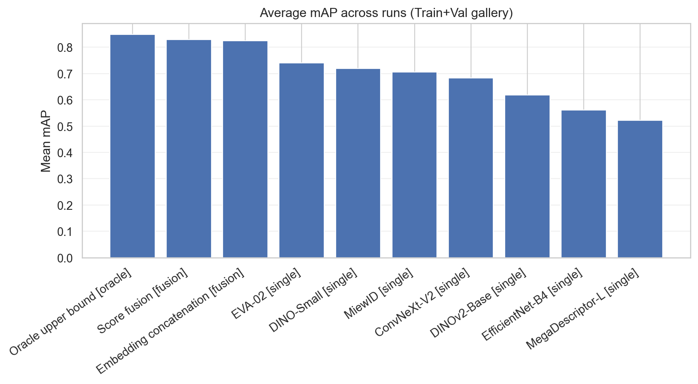 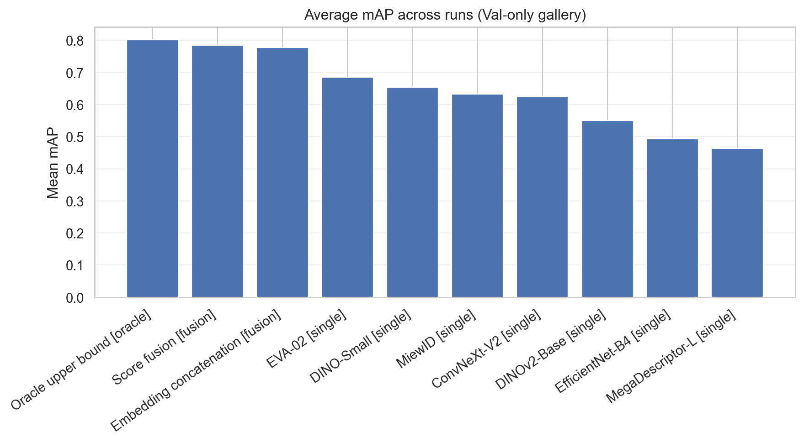

<em>Figure 1. Mean mAP across methods under the train+val gallery protocol (left) and the val-only gallery protocol (right).</em>

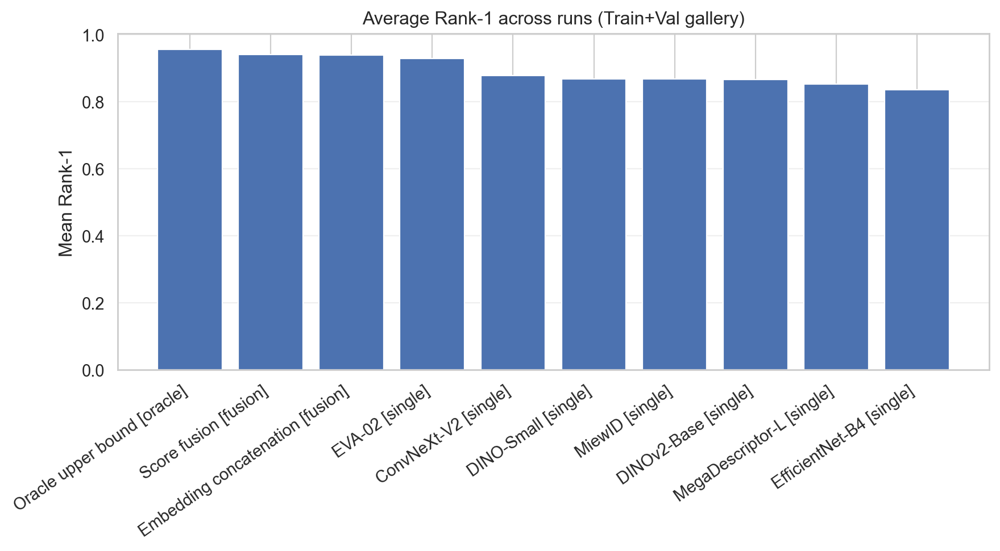 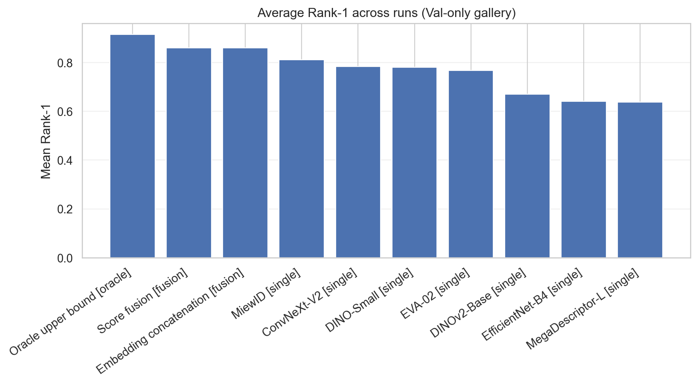

<em>Figure 2. Mean rank-1 across methods under the train+val gallery protocol (left) and the val-only gallery protocol (right).</em>

Fusion is also robust across ensemble member sets. The best fusion method is **score fusion in 8/10 runs** and **embedding concatenation in 2/10 runs**, for both protocols. Averaged over all runs, **score fusion** is slightly but consistently stronger than embedding concatenation:

- `trainval_gallery`: **0.8295 vs. 0.8240 mAP**, and **0.9415 vs. 0.9390 rank-1**.
- `valonly_gallery`: **0.7855 vs. 0.7776 mAP**, and **0.8602 vs. 0.8599 rank-1**.

Thus, both fusion strategies are effective, but late score fusion is the more reliable default in this setup.

The strongest run under both protocols is the **EVA + MiewID + ConvNeXt weighted/global ensemble with score fusion**. It reaches:

- **`trainval_gallery`**: **0.8491 mAP**, **0.9543 rank-1**, only **0.0053 mAP** below the oracle.
- **`valonly_gallery`**: **0.8107 mAP**, **0.8867 rank-1**, only **0.0016 mAP** below the oracle.

This is a strong result: for the best ensemble, the oracle leaves almost no additional recoverable headroom.

By contrast, the weakest ensemble is the **EVA + ConvNeXt + MegaDescriptor weighted/global** run. It still improves mAP, but much less strongly:

- **`trainval_gallery`**: only **+0.0329 mAP**, and even a slight **rank-1 decrease (-0.0030)**.
- **`valonly_gallery`**: **+0.0381 mAP** and **+0.0647 rank-1**.

So fusion is broadly beneficial, but not all member combinations are equally complementary.

### Key Result / Takeaway

Fusion improves retrieval substantially over the best single model under both gallery protocols, and the direction of the result is therefore robust rather than protocol-specific. The gains are larger under `valonly_gallery`, but the main point is not that one protocol is universally “harder”; it is that the ensemble advantage remains visible in both settings and becomes especially pronounced when the gallery is more restrictive. Among the tested fusion rules, **score fusion is the most reliable overall**, and the strongest configuration combines **EVA-02, MiewID, and ConvNeXt**.

## Stage 2 — Complementarity and Error-Overlap Diagnostics
--------------------------------------------------------

### Evaluation

The error-overlap analysis helps explain why the best ensembles work.

Under both protocols, the most promising complementary pair is **EVA-02 vs. MiewID**. This pair has the **lowest shared error rate** among the repeatedly observed pairs, while still disagreeing often enough to offer rescue opportunities:

- **`trainval_gallery`**: both wrong on only **0.0457** of queries, with disagreement **0.1098**.
- **`valonly_gallery`**: both wrong on **0.1100** of queries, with disagreement **0.2006**.

This is exactly the pattern one would want for fusion: the models are not making identical mistakes, and their failures overlap relatively little.

**EVA-02 vs. ConvNeXt-V2** shows a similar, though slightly weaker, pattern:

- **`trainval_gallery`**: both wrong **0.0549**, disagreement **0.0823**.
- **`valonly_gallery`**: both wrong **0.1165**, disagreement **0.2168**.

These diagnostics match the aggregate results closely: the strongest ensembles are precisely the ones that combine **EVA-02 with MiewID and ConvNeXt**.

By contrast, disagreement by itself is not sufficient. For example, **EVA-02 vs. MegaDescriptor-L** shows very high disagreement under `valonly_gallery` (**0.2654**), but also a much larger shared error rate (**0.1650**) than EVA-02 vs. MiewID. This suggests noisy or lower-quality disagreement rather than useful complementarity. That interpretation is consistent with the weak performance of ensembles that include MegaDescriptor-L.

The protocol effect is also visible here. Shared-error rates are substantially lower under `trainval_gallery`, while under `valonly_gallery` all pairs fail together more often. A plausible reason is that the larger `trainval_gallery` contains more true positives and more redundant visual evidence per identity, whereas the `valonly_gallery` removes many of these additional rescue opportunities. Even so, the better ensembles still preserve enough disagreement to make fusion worthwhile in both settings.

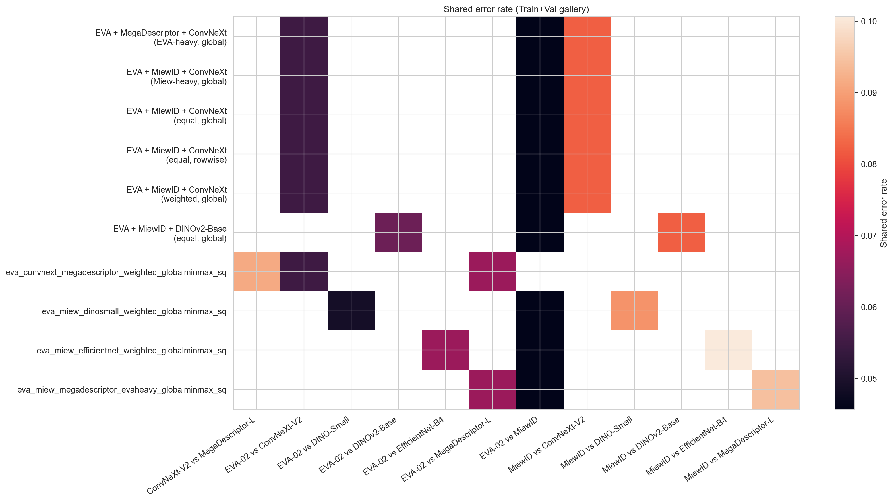 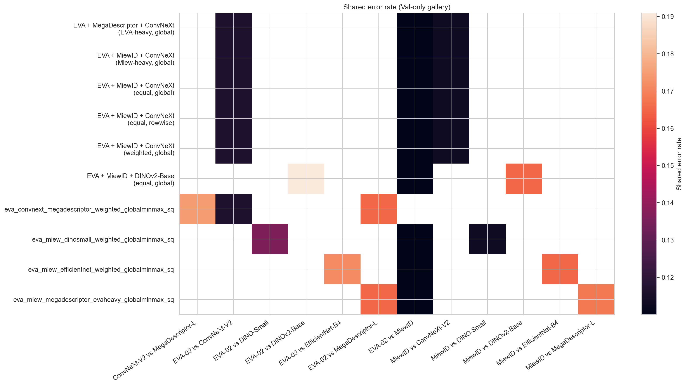

<em>Figure 3. Shared error rate (“both wrong”) for model pairs under the train+val gallery protocol (left) and the val-only gallery protocol (right).</em>

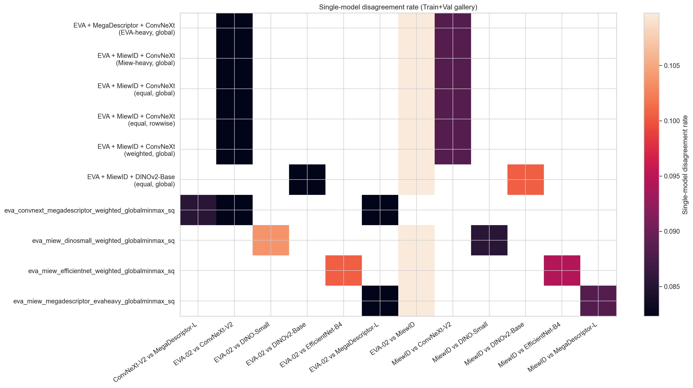 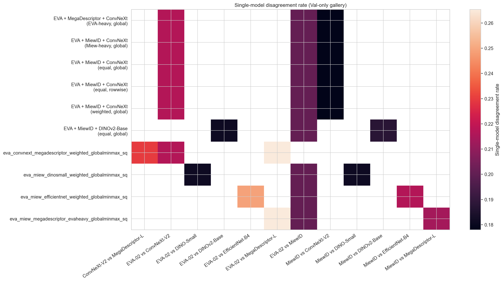

<em>Figure 4. Single-model disagreement rate for model pairs under the train+val gallery protocol (left) and the val-only gallery protocol (right).</em>

The gain plots further reinforce this interpretation. Nearly all ensembles improve mAP over the best single model, but the **rank-1 gain is much more protocol-dependent**. Under `trainval_gallery`, most runs improve rank-1 only slightly because the baseline is already near saturation. Under `valonly_gallery`, the best ensembles add around **+0.09 to +0.12 rank-1**, which is a much larger practical effect.

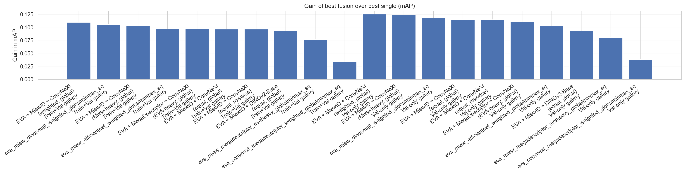

<em>Figure 5. mAP gain of the best fusion method over the best single model for each run and gallery protocol.</em>

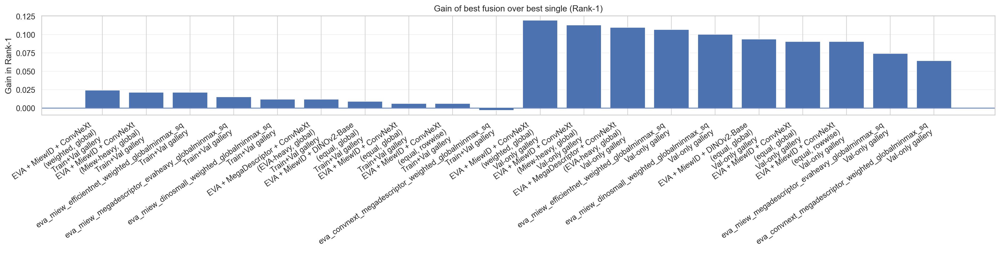

<em>Figure 6. Rank-1 gain of the best fusion method over the best single model for each run and gallery protocol.</em>

### Key Result / Takeaway

The best fusion gains are not accidental. They arise when the constituent single models make **different but still useful errors**. In this study, **EVA-02 + MiewID + ConvNeXt** provides the best balance of low shared error and meaningful disagreement, which explains why this family of ensembles dominates the leaderboard.

## Stage 3 — Identity-Level and Query-Level Analysis
--------------------------------------------------

### Evaluation

The benefits of fusion are not uniform across identities, and some of the largest positive or negative averages should be interpreted together with **identity size, burst structure, image quality, and split stability** rather than as pure model effects.

Under **`trainval_gallery`**, **25 of 31 identities** show a positive mean AP gain from best fusion over best single. The largest average gains occur for:

- **Pollyanna**: **+0.4015 AP**
- **Guaraci**: **+0.2915 AP**
- **Overa**: **+0.2882 AP**
- **Jaju**: **+0.2139 AP**

The clearest negative identities are:

- **Ipepo**: **-0.2706 AP**
- **Madalena**: **-0.1036 AP**
- **Bororo**: **-0.0787 AP**
- **Patricia**: **-0.0740 AP**

Under **`valonly_gallery`**, the distribution is similar but more polarized: **18 of 23 identities** improve on average, and some gains become very large:

- **Pollyanna**: **+0.7853 AP**
- **Pixana**: **+0.3139 AP**
- **Overa**: **+0.2962 AP**
- **Jaju**: **+0.2494 AP**

The strongest negative identities are:

- **Madalena**: **-0.0914 AP**
- **Bororo**: **-0.0841 AP**
- **Estella**: **-0.0631 AP**

This shows that fusion does not help all jaguars equally. Some identities benefit dramatically, while a small subset is harmed consistently. The result is therefore not a uniform upward shift, but a redistribution driven by identity-specific difficulty and complementarity.

A few identities admit plausible dataset-level interpretations. **Jaju**, which improves strongly in both protocols, contains many burst-associated images; even after same-burst exclusion, the remaining gallery can still contain closely related views, so complementary models may benefit unusually strongly from residual visual redundancy. By contrast, **Bororo** and **Madalena** are much less stable candidates for interpretation. In earlier data inspection, both identities were dominated by only a few burst groups, with limited viewpoint diversity, and Bororo additionally includes very poor-quality / occluded examples. In such cases, retrieval can become close to a coin flip between a handful of weak observations, so negative mean gains are easier to obtain and should not be over-interpreted. This is also consistent with the broader validation analyses, where per-run results showed noticeable standard deviation rather than perfect stability.

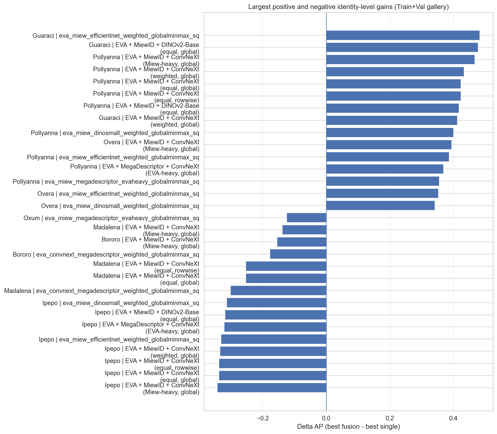 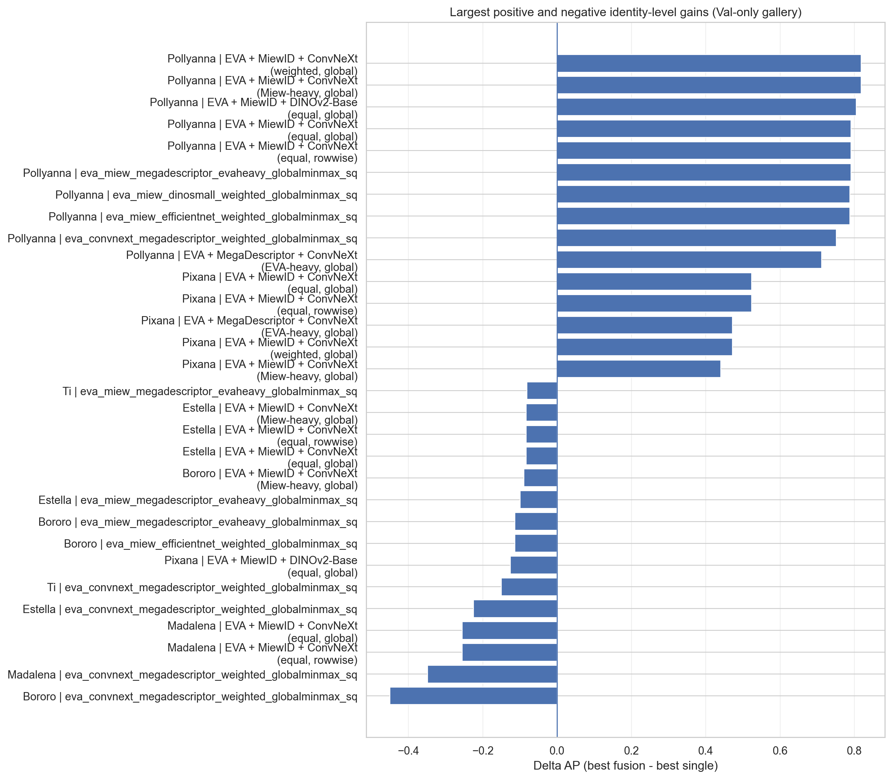

<em>Figure 7. Largest positive and negative identity-level AP gains for best fusion over best single under the train+val gallery protocol (left) and the val-only gallery protocol (right).</em>

The query-level scatter plots clarify how these gains arise. In both protocols, many of the strongest positive cases occur where the best single model has relatively low AP but fusion lifts the query to a much higher AP. This is especially pronounced under `valonly_gallery`, where many rescued queries move from roughly **0.0–0.35 AP** under the best single model to **0.6–1.0 AP** under fusion.

At the same time, the largest losses tend to occur for queries that were already strong under the single model. Fusion can therefore over-correct some easy or already well-solved cases. Still, the net balance is clearly positive, because the rescue effects on hard queries are larger and more frequent than these regressions.

This asymmetry is also informative for interpreting the protocol effect. Under `trainval_gallery`, many queries are already near the ceiling, so there is less room to improve rank-1 even though ranking quality deeper in the list still improves markedly. Under `valonly_gallery`, the more restrictive gallery yields more unresolved cases for fusion to rescue, which is why the observed gains are larger.

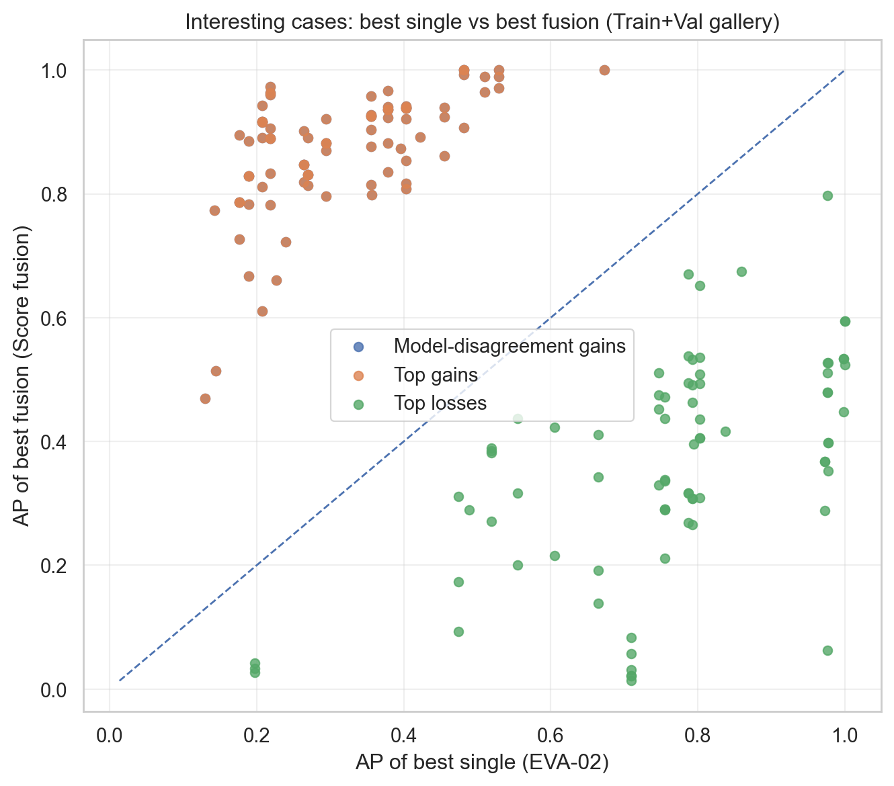 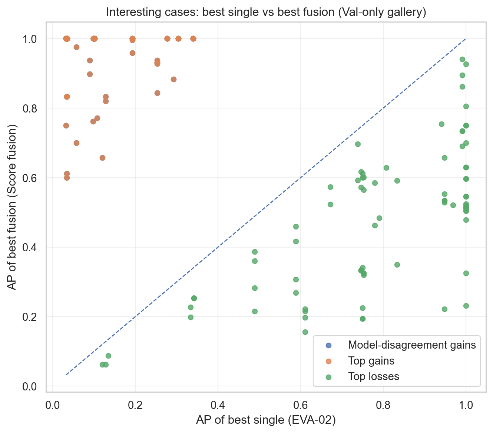

<em>Figure 8. Query-level comparison of AP under the best single model and the best fusion for selected gain/loss cases under the train+val gallery protocol (left) and the val-only gallery protocol (right).</em>

### Key Result / Takeaway

Fusion helps many identities and many hard queries, but not all of them. The overall improvement comes mainly from **rescuing difficult cases where the best single model fails**, rather than from uniformly improving already easy queries. This effect is strongest under the harder `val-only` gallery.

## Overall Conclusion
------------------

The ensemble study shows that fusion can improve Jaguar Re-ID substantially over the best single model, and that these gains are grounded in real complementarity rather than random averaging.

Three conclusions are most important.

First, **fusion is consistently beneficial**. Across 10 runs, the best single model by mAP is always **EVA-02**, yet the best fusion method improves over it in both gallery protocols. Average gains are large in **mAP** for both protocols and especially large in **rank-1** under the more restrictive `val-only` gallery.

Second, **the choice of ensemble members matters more than the choice of fusion rule**. Both score fusion and embedding concatenation help, but score fusion is slightly more reliable. The strongest results consistently come from ensembles built around **EVA-02, MiewID, and ConvNeXt**, because these models combine low shared error with useful disagreement.

Third, **the result is robust across protocols, but the gain manifests differently**. Under `trainval_gallery`, the main improvement is better ranking quality beyond the top position, while rank-1 is already close to saturation. Under `valonly_gallery`, fusion provides much larger top-1 rescue and nearly closes the oracle gap in the best run.

Overall, this experiment supports the conclusion that **ensemble fusion is a practical and effective way to improve Jaguar Re-ID**, provided that the member models are genuinely complementary. In this study, the strongest and most robust choice is **score fusion over EVA-02 + MiewID + ConvNeXt**, which comes very close to the run-wise oracle upper bound.

At the same time, the improvement did **not** translate into a clearly stronger Kaggle leaderboard result than the best single model. A few reasons are plausible. The ensemble choice was selected on this internal validation setup and may therefore be partly tuned to its specific identity mix and redundancy structure. The hidden Kaggle test may also differ in viewpoint distribution, image quality, background statistics, or calibration regime, so complementarities that help on the local split need not transfer equally well. Finally, the identity-level gains are uneven: if the external test emphasizes cases more like the unstable or low-variation identities, the average ensemble advantage can shrink substantially.
