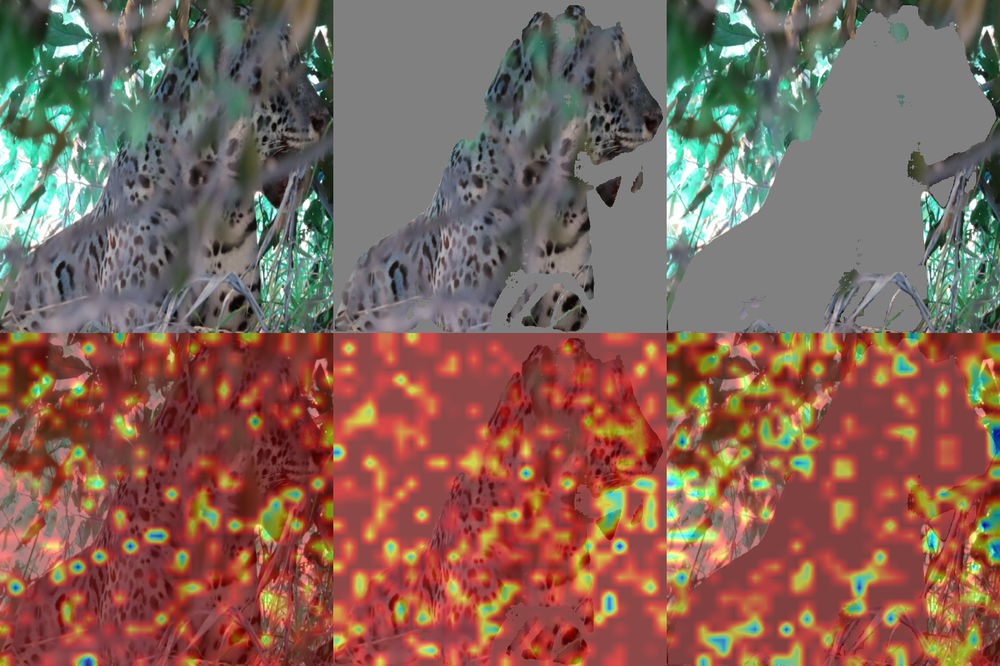
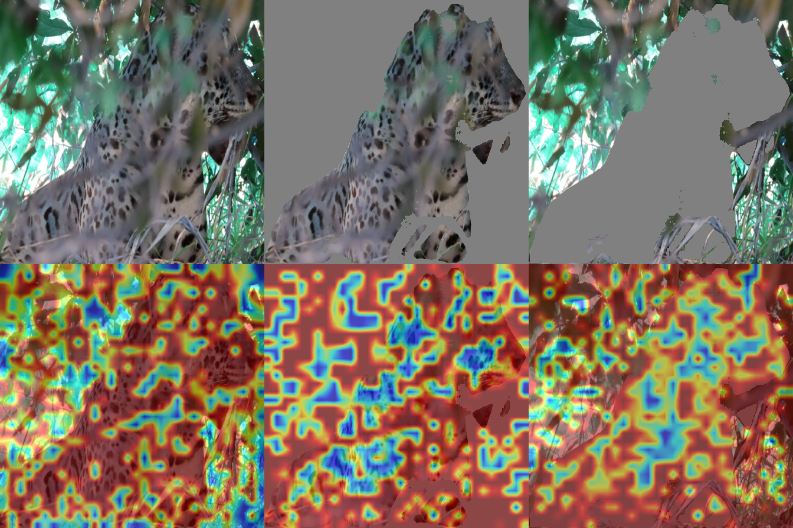
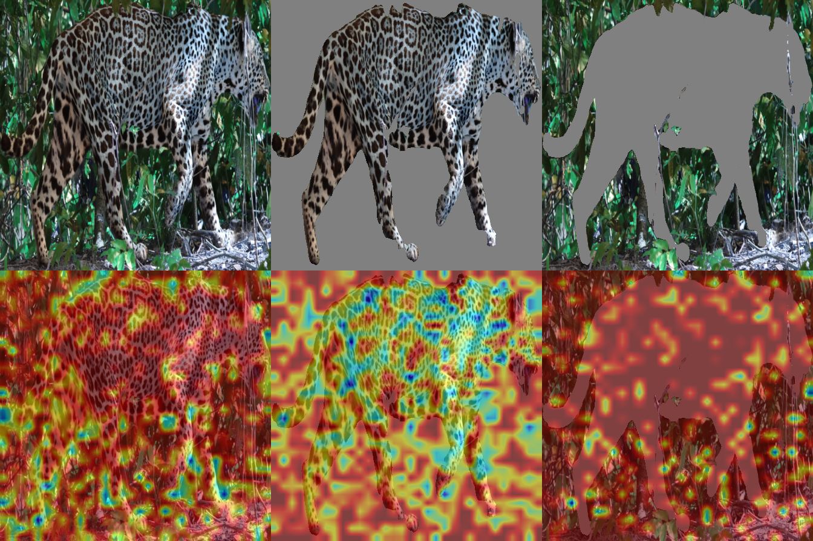
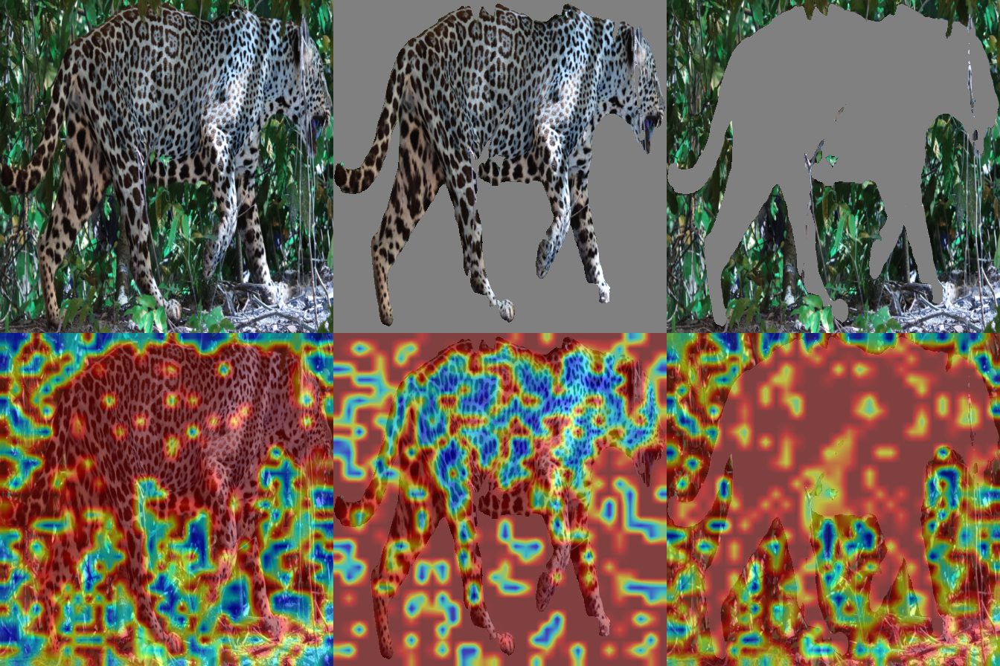

# E13 (Q0) Foreground vs Background Contribution Analysis (Data - Round 1)

**Experiment Group:** Robustness and diagnostic experiments

## Main Research Question
-----------------------------------------------------
Is retrieval-relevant identity signal preserved more in the jaguar region or in the background?

*Does Jaguar Re-ID retrieval depend primarily on jaguar appearance, or does background context retain substantial retrieval-relevant signal?*  
*How much signal is retained in jaguar-only versus background-only query views, and does retrieval rely more on foreground identity cues or on contextual background cues?*

### Secondary Research Questions
- Classification sensitivity: does true-class confidence drop more when the jaguar is removed or when the background is removed?
- Are background effects stronger for cases the model already gets wrong?
- Embedding stability: does the embedding remain closer to the original image when only the jaguar is retained or when only the background is retained?

## Experimental Setup
-----------------------------------------------------
Each query was decomposed into three variants: `orig`, `jaguar_only`, and `bg_only`.

The gallery followed the same protocol as described in **[E12 (Q1) Background Intervention](E12_eda_background_intervention.md)** and was kept fixed. We then compared the three query variants for our two leading backbones, *EVA-02* and *MiewID*, using:
- retrieval performance, especially Rank-1
- retrieval margin
- embedding stability relative to the original query embedding
- error-split analyses for `all`, `orig_rank1_correct`, and `orig_rank1_wrong`

The intervention is simple: remove either the foreground or the background and test which view still preserves retrieval-relevant signal. As in the related background-intervention analysis, the absolute metric values should be interpreted cautiously; the main evidence lies in the **relative differences across query variants**.

## Main Findings
-----------------------------------------------------
The results show a clear **backbone-dependent difference** in foreground/background reliance.

- **MiewID** is strongly **foreground-dominant**. Removing the background leaves retrieval largely intact, whereas removing the jaguar causes a severe collapse.
- **EVA02** is much more **background-sensitive**. Here, `bg_only` queries outperform `jaguar_only` queries, indicating that contextual information contributes substantially to retrieval.
- The answer to the main research question is therefore **not uniform across models**: for MiewID, the relevant signal is preserved mainly in the jaguar region, whereas for EVA02 the background retains unexpectedly strong **retrieval-useful contextual signal**.
- This should not be interpreted as evidence that identity is literally encoded in the background. Rather, in a burst-heavy dataset, strong `bg_only` performance likely reflects **correlated capture context** that remains stable across related images and can act as a shortcut for retrieval.

## Main Results: Foreground vs Background Signal
-----------------------------------------------------
| backbone_name | head_type | orig_rank1 | jaguar_only_rank1 | bg_only_rank1 | rank1_gap_jag_minus_bg | share_bg_better_rank1 | orig_mean_margin | jaguar_only_mean_margin | bg_only_mean_margin | margin_gap_jag_minus_bg | share_bg_better_margin |
|---|---|---:|---:|---:|---:|---:|---:|---:|---:|---:|---:|
| eva02 | triplet | 0.9970 | 0.7289 | 0.8645 | -0.1355 | 0.2349 | 0.6657 | 0.1704 | 0.3497 | -0.1793 | 0.6446 |
| miewid | triplet | 0.9940 | 0.9669 | 0.3343 | 0.6325 | 0.0181 | 0.4469 | 0.3537 | -0.1129 | 0.4666 | 0.0663 |

Across the full evaluation set, original performance is near-perfect for both backbones. The main question is therefore not whether retrieval works in the unmasked setting, but **which information source remains predictive after masking**.

For **MiewID**, `jaguar_only` preserves most of the original retrieval signal (`0.967` Rank-1), whereas `bg_only` drops sharply (`0.334`). For **EVA02**, the pattern reverses: `bg_only` still reaches `0.864` Rank-1 and clearly outperforms `jaguar_only` (`0.729`). Thus, MiewID behaves as the more desirable Re-ID model, while EVA02 appears substantially more dependent on contextual structure.

<em>Figure 1. Retrieval performance by backbone for `orig`, `jaguar_only`, and `bg_only` on the full evaluation set.</em>

Figure 1 provides the clearest visual summary of the main result. For **MiewID**, `jaguar_only` remains close to original performance, while `bg_only` collapses. For **EVA02**, the ordering is reversed: `bg_only` remains stronger than `jaguar_only`. The figure therefore makes the backbone-dependent difference in preserved signal immediately visible.

The same conclusion is reinforced by the jaguar-minus-background gap analysis. Positive values indicate that the foreground crop preserves more useful information; negative values indicate the opposite. For **MiewID**, both the Rank-1 and margin gaps are strongly positive, showing that the jaguar crop remains decisively more informative than the background. For **EVA02**, the corresponding gaps are negative, showing that the background often retains at least as much, and in some diagnostics more, retrieval-relevant information than the foreground crop.

<em>Figure 2. Jaguar-minus-background gaps across retrieval and stability diagnostics on the full evaluation set.</em>

This pattern is not only an average effect. The share statistics in Figure 3 show how often the background-only view outperforms the jaguar-only view on a per-query basis. For **MiewID**, background-dominant cases are rare across all diagnostics. For **EVA02**, they are common, especially for margin and embedding stability. This indicates that the EVA02 effect is distributed across many queries rather than being driven by a few isolated outliers.

<em>Figure 3. Share of queries for which `bg_only` exceeds `jaguar_only` on each diagnostic.</em>

The broader ranking and stability summary points in the same direction.

| backbone | jaguar_only mean gold rank | bg_only mean gold rank | share bg more stable |
|---|---:|---:|---:|
| eva02 | 12.74 | 4.43 | 0.663 |
| miewid | 1.38 | 44.83 | 0.063 |

For **EVA02**, `bg_only` also outperforms `jaguar_only` on broader ranking diagnostics, including mean gold rank (`4.43` vs `12.74`), and the background-only embedding is more often closer to the original embedding (`66.3%` of cases). For **MiewID**, the opposite holds consistently: `jaguar_only` remains much stronger than `bg_only`, and the original embedding stays far closer to the jaguar-only representation than to the background-only view.

## Error-Split Analysis
-----------------------------------------------------
| background | backbone_name | head_type | group | jaguar_only_rank1 | bg_only_rank1 | share_bg_better_rank1 | share_bg_better_margin | share_bg_more_stable |
|---|---|---|---|---:|---:|---:|---:|---:|
| base | eva02 | triplet | all | 0.7289 | 0.8645 | 0.2349 | 0.6446 | 0.6627 |
| base | eva02 | triplet | orig_rank1_correct | 0.7311 | 0.8671 | 0.2356 | 0.6435 | 0.6616 |
| base | eva02 | triplet | orig_rank1_wrong | 0.0000 | 0.0000 | 0.0000 | 1.0000 | 1.0000 |
| base | miewid | triplet | all | 0.9669 | 0.3343 | 0.0181 | 0.0663 | 0.0633 |
| base | miewid | triplet | orig_rank1_correct | 0.9697 | 0.3364 | 0.0182 | 0.0667 | 0.0606 |
| base | miewid | triplet | orig_rank1_wrong | 0.5000 | 0.0000 | 0.0000 | 0.0000 | 0.5000 |

The error-split analysis broadly confirms the same picture. For the full set and for the originally correct subset, the conclusions are essentially unchanged: **MiewID remains foreground-dominant, whereas EVA02 remains background-sensitive**.

The originally wrong subset is much smaller and should therefore be treated as a supplementary diagnostic rather than as standalone evidence. Still, the figures below are directionally informative because they show how the masked variants behave on already difficult queries.

<em>Figure 4. Retrieval performance by backbone for the `orig_rank1_wrong` subset.</em>

Figure 4 shows that the masked variants behave far less stably in this subset, which is expected for cases that were already incorrect in the original setting. The subset is too small for strong quantitative conclusions, but it is consistent with the broader finding that masking amplifies instability in hard cases.

<em>Figure 5. Jaguar-minus-background gaps for the `orig_rank1_wrong` subset.</em>

<em>Figure 6. Share of background-dominant cases in the `orig_rank1_wrong` subset.</em>

Figures 5 and 6 should therefore be interpreted with caution. They suggest that for difficult queries, background information can remain influential, but the sample size is too small for strong claims. Their main value is diagnostic: they show that the foreground-versus-background distinction does not disappear in hard cases, but becomes noisier and less stable.

## Qualitative Evidence
-----------------------------------------------------
The quantitative results indicate that background information can remain retrieval-useful, especially for the more background-sensitive backbone. The qualitative saliency examples below help illustrate **what kind of signal is still present after masking**.

The examples should be interpreted carefully. They were generated with two CAM variants, **Grad-CAM** and **Eigen-CAM**, which differ in visual character and should not be read as interchangeable pixel-accurate explanations. Grad-CAM is score-conditioned and tends to appear more localized or hotspot-like, whereas Eigen-CAM often produces smoother and more global activation structure. For that reason, the maps are used here only at the level of **broad spatial tendencies**—for example, whether activation falls mainly on the jaguar body or remains strong in the background—and not as precise localization evidence. Accordingly, the qualitative figures are intended as **illustrative support** for the quantitative findings, not as standalone proof.

A useful way to read the examples is to compare whether the same broad pattern persists across both CAM variants for the same image. If both Grad-CAM and Eigen-CAM indicate substantial activation on contextual background structure in the `bg_only` view, that strengthens the interpretation that the background is not treated as irrelevant noise. Conversely, if both variants concentrate on the torso, flank, and coat pattern in the `jaguar_only` view, that is more consistent with identity-driven retrieval.

### Qualitative Example A: Background-sensitive case
A good first qualitative example is the **occluded jaguar in dense foliage**, because it visually matches the main phenomenon of interest: the scene contains rich contextual structure, and the background-only view remains highly organized.

  
  

<em>Figure 7. Representative background-sensitive example. Left: Grad-CAM. Right: Eigen-CAM. In each grid, the top row shows original, jaguar-only, and background-only query variants; the bottom row shows the corresponding saliency overlays.</em>

In Figure 7, the `jaguar_only` view still preserves activation on the animal body, especially over the flank and torso region. However, the `bg_only` view also remains far from blank. In both CAM variants, structured response persists on foliage, branches, and bright scene regions. The exact visual appearance differs across methods—Grad-CAM is more hotspot-like, whereas Eigen-CAM is smoother and more diffuse—but the same qualitative tendency remains visible in both. This is consistent with the quantitative finding that contextual structure can carry substantial retrieval-useful signal.

### Qualitative Example B: Foreground-dominant case
A complementary example should show the opposite situation more clearly: a case where the jaguar crop retains the more semantically appropriate signal for Re-ID. The **full-body side-view jaguar** is a good choice because the animal silhouette and coat pattern are both prominent.

  
  

<em>Figure 8. Representative foreground-dominant example. Left: Grad-CAM. Right: Eigen-CAM. In each grid, the top row shows original, jaguar-only, and background-only query variants; the bottom row shows the corresponding saliency overlays.</em>

In Figure 8, the `jaguar_only` view retains strong activation across the animal body, especially on the torso and coat-pattern regions that are plausible identity carriers in a Re-ID setting. The `bg_only` view still shows some structured response, but the semantically meaningful focus lies much more clearly on the jaguar itself. This is the more desirable behavior for identity matching and visually mirrors the model behavior seen for the more foreground-dominant backbone.

Overall, the qualitative evidence supports the same interpretation as the quantitative analysis. The foreground contains the intended identity signal, especially in coat pattern and body shape, but correlated background structure can also retain substantial retrieval-useful information. Importantly, the heatmaps should be read as **illustrative consistency checks** rather than as precise causal localization maps.

## Interpretation
-----------------------------------------------------
The experiment shows that **foreground dominance is architecture-dependent**.

For **MiewID**, the jaguar crop retains most of the retrieval ability, while the background alone is largely insufficient. This indicates that the model has learned the intended identity signal and is relatively robust to background removal.

For **EVA02**, the background remains surprisingly predictive. Since `bg_only` outperforms `jaguar_only`, the model appears to exploit contextual information to a much greater extent. In a burst-heavy dataset, one plausible explanation is **burst-level contextual consistency**: near-duplicate images often preserve similar background, viewpoint, lighting, and capture conditions, allowing the model to use repeated scene context as a shortcut cue for retrieval. The figures above are consistent with this interpretation: the quantitative plots show that `bg_only` remains competitive, and the qualitative heatmaps show that structured scene regions can still attract substantial activation after masking.

In sum, the experiment supports the broader claim that **background shortcuts can materially contribute to Jaguar Re-ID retrieval**, but that the extent of this problem depends strongly on the backbone.

## Limitations
-----------------------------------------------------
The masked query variants may introduce artifacts of their own, so the observed effects cannot be interpreted as pure measures of semantic foreground/background contribution. Instead, they should be read as a practical diagnostic of **which masked view still preserves model-relevant signal**.

The qualitative heatmaps add useful intuition, but they also have clear interpretive limits. Different CAM methods emphasize different aspects of the representation, and neither Grad-CAM nor Eigen-CAM should be treated here as exact localization truth. Their value lies in showing whether the broad foreground-versus-background tendency is visually consistent across examples and methods.

In addition, the `orig_rank1_wrong` subset is very small because original Rank-1 performance is near-perfect for both backbones. This limits the strength of error-focused conclusions.

A further limitation is that strong `bg_only` retrieval may partly reflect **dataset structure rather than purely model-internal background preference**. In particular, burst redundancy and near-duplicate samples can preserve capture context across related images, making background cues unusually useful under masked-query interventions.