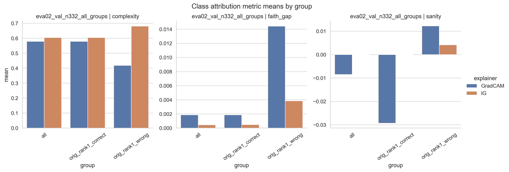
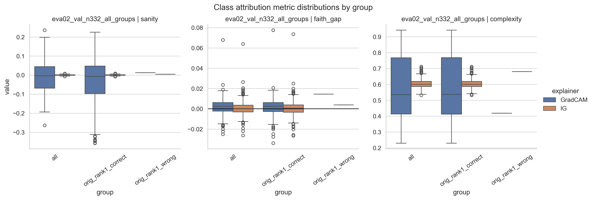
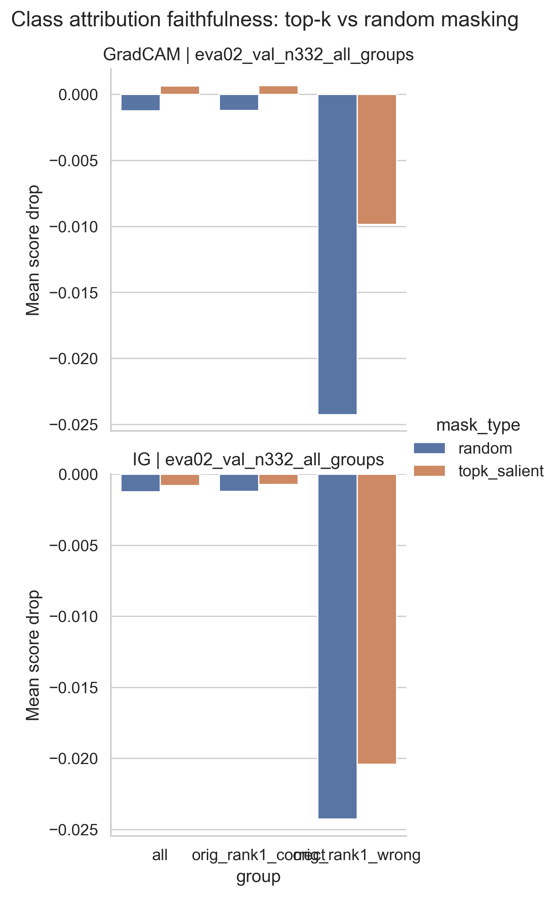
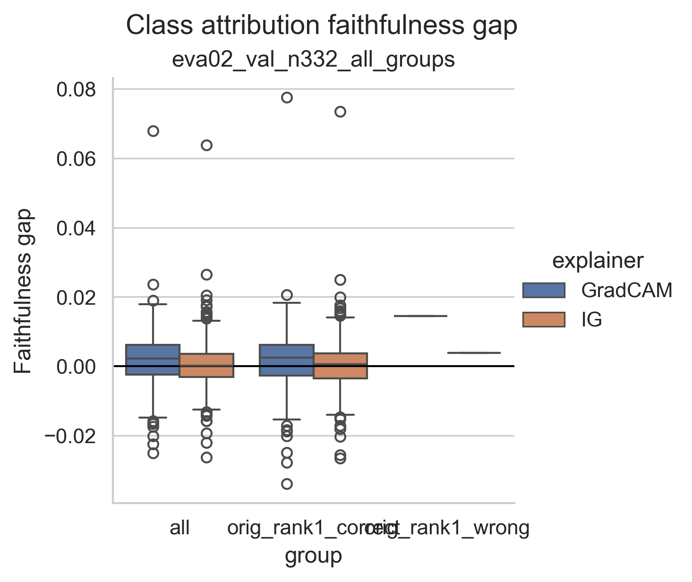
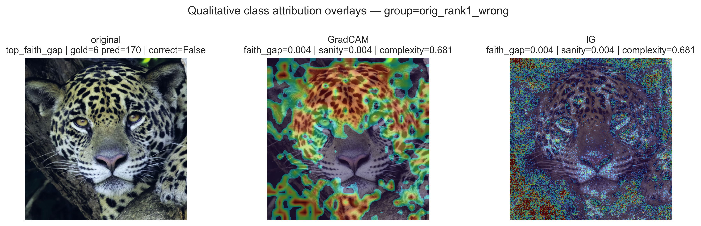

# E14 (Q2) Class Attributions (Data - Round 1)

**Experiment Group:** Interpretability analyses

## Main Research Question
---------------------------------------------------
Which image regions appear to drive the model’s identity-class predictions, and are these class-attribution explanations meaningfully aligned with jaguar identity cues?

## Scientific Sub-Questions
---------------------------------------------------
- Do the explanations emphasize plausible jaguar identity regions such as the **head, face, torso, flank contour, and coat pattern**, or do they also rely strongly on **contextual background**?
- Do the explanations remain meaningful across the groups `all`, `orig_rank1_correct`, and `orig_rank1_wrong`?
- Do the quantitative diagnostics support the qualitative impression that the highlighted regions are relevant to the model’s class prediction?

## Methodological Sub-Question
---------------------------------------------------
How do **GradCAM** and **Integrated Gradients (IG)** compare on these class-attribution diagnostics, quantitatively and qualitatively, and does explainer choice materially affect the interpretation? This methodological comparison is examined separately in **[E16 (Q2a) Explainer Comparison for Class Attributions](E16_eda_xai_metrics.md)**.

## Setup
---------------------------------------------------
We generated **class-target explanations** for the EVA-02 model using **GradCAM** and **Integrated Gradients (IG)** for three groups: `all`, `orig_rank1_correct`, and `orig_rank1_wrong`. The saved explanations were then evaluated with:

- a **sanity check** based on randomization,
- a **faithfulness test** comparing top-k salient masking against a same-sized random-mask control,
- and a **complexity** metric.

In addition, qualitative overlays were inspected to assess whether the highlighted regions plausibly align with jaguar identity cues such as the head, face, torso, flank, and coat pattern, or whether they extend strongly into contextual background.

The quantitative summary is given in **Table 1**. Metric means and distributions are shown in **Figure 1** and **Figure 2**, the masking-based faithfulness analysis in **Figure 3** and **Figure 4**, and representative qualitative overlays in **Figure 5** and **Figure 6**.

## Main Findings
---------------------------------------------------
The results give a mixed but coherent picture.

- The explanations are **not trivially stable under randomization**, which supports their basic validity.
- At the same time, the masking-based **faithfulness evidence is weak**: top-k salient masking does not consistently reduce the target-class score more than a same-sized random mask.
- Qualitatively, the maps often highlight plausible jaguar regions, especially under **GradCAM**, but they also frequently extend into **background context**.
- Overall, the class predictions appear to depend on a **mixture of jaguar appearance and contextual cues**, while the post-hoc explanations remain only **partially meaningful**.

## Scientific Results: What the Class Attributions Suggest About the Model
---------------------------------------------------

### Quantitative summary
The main quantitative results are summarized in **Table 1**.

**Table 1. Main class-attribution summary by group and explainer.**  
| group | explainer | sanity | faithfulness gap | top-k drop | random drop | complexity |
|---|---|---:|---:|---:|---:|---:|
| all | GradCAM | -0.0085 | 0.0019 | 0.0006 | -0.0012 | 0.5785 |
| all | IG | 0.0001 | 0.0005 | -0.0008 | -0.0012 | 0.6044 |
| orig_rank1_correct | GradCAM | -0.0293 | 0.0019 | 0.0007 | -0.0012 | 0.5790 |
| orig_rank1_correct | IG | -0.0001 | 0.0005 | -0.0007 | -0.0012 | 0.6041 |
| orig_rank1_wrong | GradCAM | 0.0122 | 0.0144 | -0.0098 | -0.0243 | 0.4183 |
| orig_rank1_wrong | IG | 0.0041 | 0.0038 | -0.0204 | -0.0243 | 0.6805 |

Across the two main groups, `all` and `orig_rank1_correct`, the results are numerically very similar. This suggests that the behavior of the explanations is not driven mainly by the small subset of originally wrong retrieval cases.

As shown in **Table 1**, sanity values are close to zero for both explainers, which is the expected direction if explanations change under randomization rather than remaining spuriously stable. By contrast, the faithfulness gaps are very small overall, suggesting that the maps do not provide strong evidence of sharply localized, uniquely decision-critical regions.

This overall pattern is visualized in **Figure 1** and **Figure 2**, which reinforce the same interpretation at the aggregate and distribution level.

<em>Figure 1. Mean class-attribution metrics by group and explainer.</em>

<em>Figure 2. Distribution of sanity, faithfulness gap, and complexity by group and explainer.</em>

### Faithfulness in more detail
The masking-based faithfulness comparison is shown in **Figure 3** and **Figure 4**.

<em>Figure 3. Mean target-score drop under top-k salient masking versus random masking.</em>

<em>Figure 4. Distribution of faithfulness gaps by group and explainer.</em>

For the scientific question, the key point from **Figure 3** is that in the two main groups, top-k masking does **not** produce a clearly stronger target-score drop than random masking. This weakens the claim that the maps cleanly isolate the regions most responsible for the class decision.

The same conclusion follows from **Figure 4**. In `all` and `orig_rank1_correct`, the faithfulness-gap distributions are only slightly shifted above zero, so any masking-based evidence for meaningful localization remains modest.

The `orig_rank1_wrong` group shows larger absolute effects in **Figure 3** and **Figure 4**, but this should be interpreted carefully because the subset is very small and the random-mask baseline is already highly disruptive. This group is therefore best treated as a hard-case diagnostic rather than as the main basis for scientific interpretation.

### Qualitative evidence: what regions are highlighted?
The qualitative overlays help answer the core scientific question of **which image regions are actually emphasized**.

These examples should be interpreted cautiously: they are not pixel-accurate ground truth, and the two explainers differ substantially in visual character. Still, they are informative at the level of **broad spatial tendencies**.

<em>Figure 5. Qualitative class-attribution overlays for the `all` group. Each row shows the original image, GradCAM overlay, and IG overlay.</em>

<em>Figure 6. Qualitative class-attribution overlays for the `orig_rank1_wrong` group.</em>

**Figure 5** suggests that the model’s class predictions are influenced by a **mixture of jaguar-centered and contextual signal**. In the stronger examples, the maps emphasize semantically plausible regions such as the **head, face, shoulder, torso, flank contour, and coat markings**. At the same time, many examples also show substantial activation on **vegetation, trunks, water edges, or surrounding texture**. Thus, the class evidence does not appear to be cleanly restricted to the jaguar body alone.

**Figure 6** should be read more cautiously because `orig_rank1_wrong` is extremely small, but it points in the same general direction: the hard cases do not become cleaner or more localized. If anything, they further support the view that the explanations remain only partially specific.

Taken together, **Table 1** and **Figure 1–Figure 6** support the following scientific answer: the class-attribution maps suggest that the model uses plausible jaguar identity cues, but they also repeatedly implicate surrounding context, and the masking diagnostics do not strongly validate the highlighted regions as uniquely decision-critical. This finding is in line with the previous experiment **[E13 (Q0) Foreground vs Background Contribution Analysis](E13_eda_foreground_contribution.md)**.

## Overall Answer to the Research Questions
---------------------------------------------------

### Main scientific question
Which image regions appear to drive the model’s identity-class predictions, and are these explanations meaningfully aligned with jaguar identity cues?

The evidence from **Table 1**, **Figure 1–Figure 4**, and the qualitative overlays in **Figure 5–Figure 6** suggests that the model relies on a **mixture of jaguar appearance and contextual structure**. The maps often highlight plausible identity regions such as the head, torso, flank, and coat pattern, but they also frequently extend into vegetation, trunks, water, and other background regions.

These explanations are therefore **partly meaningful, but not strongly validated**. They pass the sanity criterion in a broad sense, but they do **not** receive strong support from masking-based faithfulness.

## Concise Conclusion
---------------------------------------------------
The class-attribution experiment supports a careful, mixed conclusion. The explanations are **not trivially stable under randomization**, which is encouraging, but they also **do not provide strong masking-based faithfulness evidence**. Scientifically, the overlays suggest that EVA-02’s class predictions are influenced by both **jaguar-centered appearance cues** and **contextual background structure**.

## Limitations
---------------------------------------------------
The masking-based faithfulness test is conservative: failure to outperform a random-mask control does not prove that a map is useless, only that it does not cleanly identify uniquely decision-critical pixels under this protocol.

The qualitative overlays are helpful for interpretation, but they are not localization ground truth. In particular, GradCAM and IG differ substantially in visual character, so qualitative judgments should be made at the level of **broad spatial plausibility**, not exact pixel precision.

Finally, the `orig_rank1_wrong` subset is extremely small and should therefore be interpreted only descriptively.