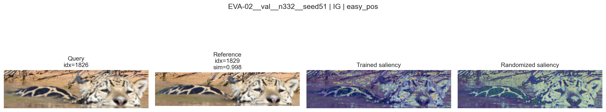
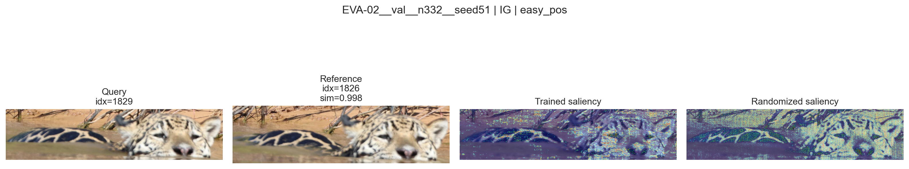
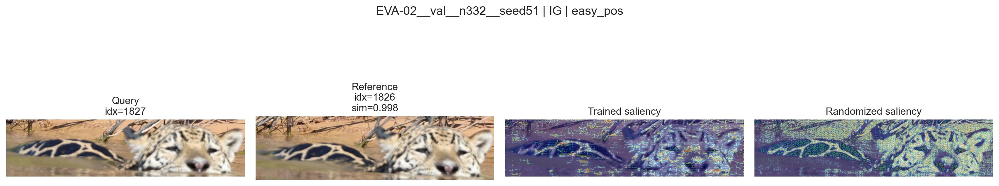
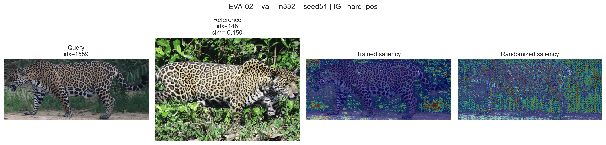
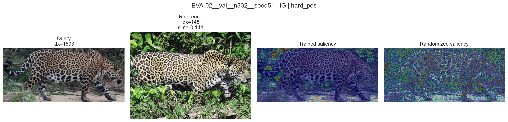
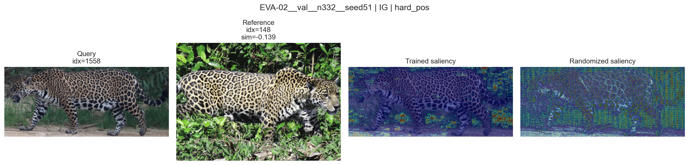
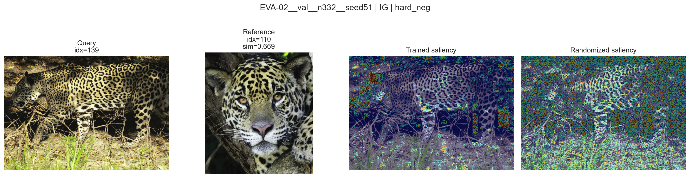
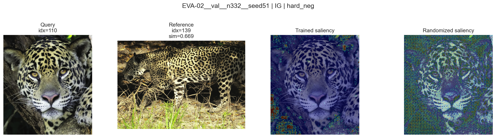
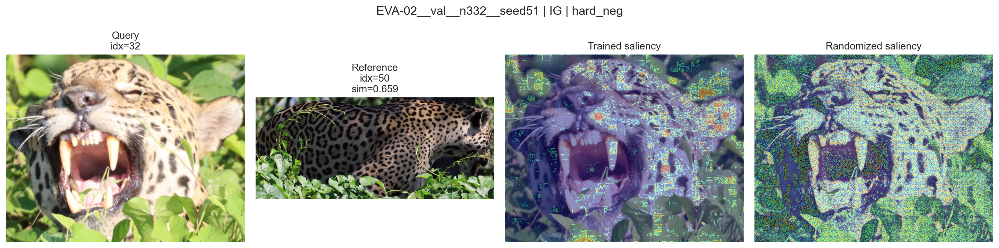
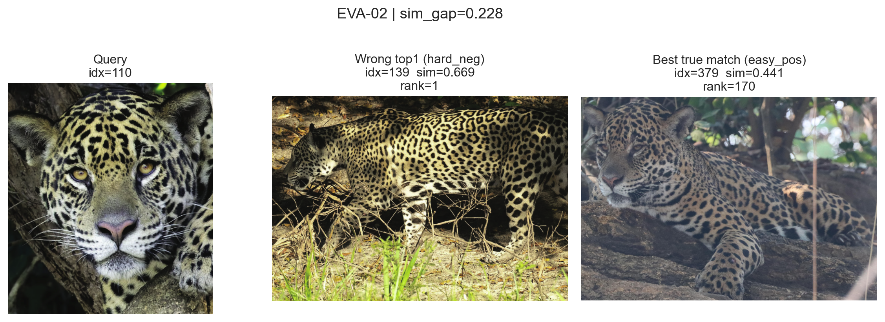

# E15 (Q31) Pairwise Similarity Explanations (Data - Round 1)

**Experiment Group:** Interpretability analyses

## Main Research Question
----------------------

Which image regions drive pairwise similarity scores in Jaguar Re-ID, and how do these regions differ across correct, difficult, and incorrect retrieval pairs?

More specifically, this experiment asks two connected questions:

1. What visual evidence supports high pairwise similarity for **easy positives**, **hard positives**, and **hard negatives**?
2. In a retrieval failure, why can a wrong gallery image outrank the best available true match?

## Setup / Intervention
--------------------

This experiment analyzes **pairwise similarity explanations** for a fixed trained Re-ID model (**EVA-02**) on a reproducible validation subset from **Round 1**. The focus is not on class prediction, but on the learned **query–gallery similarity score** that drives retrieval ranking.

Representative query–reference pairs were selected from three qualitatively different regimes:

- **easy positives**: same-identity matches with extremely high similarity and near-redundant appearance,
- **hard positives**: same-identity matches that remain visually challenging because pose, visibility, or scene conditions differ strongly,
- **hard negatives**: wrong-identity pairs that nevertheless achieve high similarity and are therefore especially diagnostic.

For each selected pair, post-hoc pairwise explanations were generated with **Integrated Gradients (IG)**. The displayed panels show the query image, the reference image, the trained saliency overlay, and a randomized-model overlay. The randomized overlay is included only as visual context here; the systematic sanity / faithfulness / complexity evaluation is analyzed separately in **E16**.

## Method / Procedure
------------------

The analysis proceeded in two steps.

First, pairwise explanation panels were inspected across the three pair types. The goal was to understand whether the similarity signal is mainly driven by jaguar-centered evidence, which parts of the animal are emphasized, and how discriminative this evidence appears in easy versus difficult matches.

Second, a retrieval failure analysis was performed. For a failed query, the wrong top-1 match was contrasted with the best available true match. This makes it possible to inspect not only where the model looks, but also what kind of visual correspondence is strong enough to produce a ranking error.

The interpretation is intentionally qualitative and case-based. Quantitative explanation validation is deferred to **[E16 (Q2a) Explainer Comparison for Class Attributions](E16_eda_xai_metrics.md)**, so the present document focuses on what the maps appear to reveal about the similarity signal itself.

## Pair-Type Comparison
--------------------------------

### Evaluation

The pair-type comparison shows a clear progression from **highly redundant and stable matches** to **visually plausible but identity-incorrect matches**.

#### Easy positives

The easy-positive examples are almost near-duplicate matches. In all three displayed cases, the similarity score is essentially saturated at **0.998**, and the query and reference differ only minimally. The corresponding IG maps are strongly jaguar-centered and align with the same visible structures across both images, especially the exposed coat pattern, body contour, and head region.

This regime is important mainly as a sanity anchor for the qualitative analysis. Because the two images are so visually similar, the model can rely on strong local correspondence that is both easy to recognize and easy to explain. These examples therefore show what pairwise similarity looks like when the retrieval problem is close to redundant matching.

<em>Figure 1. Easy-positive example: near-redundant same-identity match with similarity 0.998.</em>

<em>Figure 2. Easy-positive example: reversed pairing of the same near-duplicate match.</em>

<em>Figure 3. Easy-positive example with the same highly redundant visual evidence.</em>

#### Hard positives

The hard-positive examples are much more informative, because they represent **same-identity matches that no longer look trivially alike**. In the displayed panels, all three queries are matched against the same reference (**idx = 148**), but the similarities are low and even slightly negative: **-0.139**, **-0.144**, and **-0.150**.

This matters because it shows that "positive" in the retrieval sense does not imply strong similarity under the learned embedding. These are true matches, but they are difficult true matches. Compared with the easy positives, the images differ more strongly in viewpoint, pose, body articulation, and scene appearance. The saliency overlays remain focused on the jaguar rather than the background, but the relevant evidence is spread more broadly across the body — especially flank pattern, torso, legs, and body outline. The maps therefore suggest that the model is still using plausible animal-centered evidence, but the correspondence is weaker, more distributed, and less redundant than in the easy-positive regime.

<em>Figure 4. Hard-positive example with similarity -0.150.</em>

<em>Figure 5. Hard-positive example with similarity -0.144.</em>

<em>Figure 6. Hard-positive example with similarity -0.139.</em>

#### Hard negatives

The hard-negative panels are the most diagnostic for retrieval failure. Here the matched gallery image is **not** the same identity, yet the similarity is high: the displayed examples reach **0.659**, **0.669**, and **0.669**. This is a striking contrast to the hard positives above, whose true-match similarities are much lower.

Qualitatively, the maps still emphasize plausible jaguar evidence. In the face-dominated example, the attribution concentrates around facial structure, muzzle, whiskers, and nearby coat pattern. In the full-body example, the map emphasizes the torso outline and flank texture. In the open-mouth example, the model again focuses on salient animal structures rather than empty background.

The important point is therefore not that the model is "looking at the wrong thing" in any obvious sense. Instead, the wrong-identity image can present **very convincing animal-centered correspondence** that is simply not identity-specific enough. Hard negatives thus suggest that the main problem is insufficient discriminability of jaguar evidence, not a complete shift away from the animal.

<em>Figure 7. Hard-negative example with similarity 0.669.</em>

<em>Figure 8. Hard-negative example with similarity 0.669.</em>

<em>Figure 9. Hard-negative example with similarity 0.659.</em>

Across the three pair types, the qualitative transition is therefore quite coherent:

- **easy positives** are supported by highly redundant overlap and almost identical visible structure,
- **hard positives** rely on broader, weaker, but still correct jaguar evidence,
- **hard negatives** are driven by plausible jaguar evidence that remains visually strong but is not sufficiently identity-specific.

This is the main qualitative result of the pair-type comparison.

### Key Result / Takeaway

Pairwise similarity is driven primarily by **jaguar-centered appearance cues**, especially coat pattern, body contour, and facial structure. What changes across pair types is not a simple shift from animal to background, but a shift from **highly redundant and discriminative evidence** (easy positives) to **broader and less identity-specific evidence** (hard positives and especially hard negatives).

## Failure Analysis
---------------------------

### Evaluation

The failure analysis sharpens the interpretation above by looking at an actual ranking error.

Across the evaluated validation subset, **EVA-02 produced only 1 failure among 332 queries**, corresponding to a failure rate of **0.0030**. For that failed query, the median rank of the best true match in the failure set is **170**, and the median similarity gap between the wrong match and the best true match is **0.2283**. Since there is only one failure, these summary values are effectively the statistics of the single displayed case.

**Table 1. Failure summary for EVA-02 on the analyzed validation subset.**

| model | n_queries | n_failures | failure_rate | median_easy_rank_in_failures | median_sim_gap_wrong_minus_right |
|---|---:|---:|---:|---:|---:|
| EVA-02 | 332 | 1 | 0.0030 | 170 | 0.2283 |

The failure triptych in **Figure 10** shows the relevant comparison. The query is image **idx = 110**. The wrong top-1 hard negative is **idx = 139** with similarity **0.669** and rank **1**. The best available true match is **idx = 379** with similarity **0.441**, but it appears only at rank **170**.

<em>Figure 10. Failure case for EVA-02: query, wrong top-1 hard negative, and best true match.</em>

This is not a marginal tie. The wrong image outranks the true match by a substantial similarity margin (**0.669 vs. 0.441**, gap **0.228**), and the true match is pushed far down the ranking. Qualitatively, the wrong top-1 presents a strong, sharp, pattern-rich side view with clear coat texture and body structure. The true match, by contrast, is darker, softer, and visually less aligned to the frontal query.

This case supports the interpretation from the hard-negative panels: the retrieval error does not appear to come from obvious background distraction. Rather, the model seems to prefer the gallery image that offers the **stronger overall visual correspondence** in terms of texture, shape, and exposed animal structure, even though it is the wrong identity. In other words, the similarity function appears to be plausible but insufficiently identity-specific in this difficult case.

### Key Result / Takeaway

The single observed EVA-02 failure is informative because it is **substantive rather than borderline**. The wrong image clearly outranks the best true match, and it does so because it presents stronger overall jaguar correspondence. This supports the view that retrieval failures arise less from irrelevant background attention than from **confusion between visually convincing but identity-incorrect animal evidence**.

## Overall Conclusion
------------------

The qualitative pairwise-similarity analysis suggests that **EVA-02 mainly bases similarity on jaguar-centered evidence**, especially coat pattern, body contour, and facial structure.

Three conclusions are most important.

First, the easy-positive regime shows that the method captures strong true correspondence when two images are almost redundant. These examples behave as expected and provide a useful visual anchor.

Second, the hard-positive and hard-negative regimes are more revealing. Hard positives show that correct same-identity evidence can become weak and spatially distributed under viewpoint and scene changes, while hard negatives show that wrong-identity images can still receive high similarity when they share strong generic jaguar structure.

Third, the failure case confirms that a wrong gallery image can outrank the true match by a **large margin**, not because the model obviously ignores the jaguar, but because the wrong image offers stronger apparent visual correspondence than the true one.

Overall, this experiment supports a cautious but coherent interpretation: the learned pairwise similarity signal is usually based on **plausible animal evidence**, yet that evidence is **not always specific enough to reliably separate difficult positives from hard negatives**. A more systematic validation of explanation quality is deferred to **E16**, where sanity, faithfulness, and complexity are analyzed quantitatively.

## Main Findings
-------------

- Pairwise similarity maps are mostly centered on the **jaguar**, not on empty background.
- **Easy positives** are dominated by near-redundant overlap and have similarity scores of about **0.998** in the shown examples.
- **Hard positives** remain jaguar-centered, but their evidence is broader and weaker; the shown same-identity pairs have similarities between **-0.150** and **-0.139**.
- **Hard negatives** receive high similarity despite wrong identity; the shown examples score **0.659–0.669**.
- The EVA-02 failure analysis contains **1 failure in 332 queries** (**0.3%**), and in that case the wrong top-1 outranks the best true match by a similarity gap of **0.228**.
- The qualitative results suggest that errors arise mainly from **insufficient identity specificity of plausible jaguar evidence**, rather than from obvious background reliance.

## Main Results Table
------------------

| section | result |
|---|---|
| Easy positives | near-duplicate same-identity matches with similarity ≈ **0.998** and highly stable jaguar-centered evidence |
| Hard positives | same-identity matches remain difficult; shown similarities **-0.150 to -0.139** with broader distributed evidence across torso, legs, and outline |
| Hard negatives | wrong-identity matches can still score **0.659–0.669** when coat pattern and body structure align strongly |
| Failure case | **1 / 332** EVA-02 failures; wrong top-1 similarity **0.669** vs. best true match **0.441**, with the true match only at **rank 170** |
| Interpretation | similarity is usually based on plausible animal evidence, but this evidence is not always identity-specific enough for difficult retrieval |

## Limitation
----------

This section is intentionally **qualitative** and based on a small set of representative examples. The failure analysis is especially limited because the evaluated subset contains only **one** observed EVA-02 failure. The randomized overlays shown in the panels are included only as visual context; they are **not** interpreted systematically here. Formal explanation evaluation is handled separately in **E16**.
