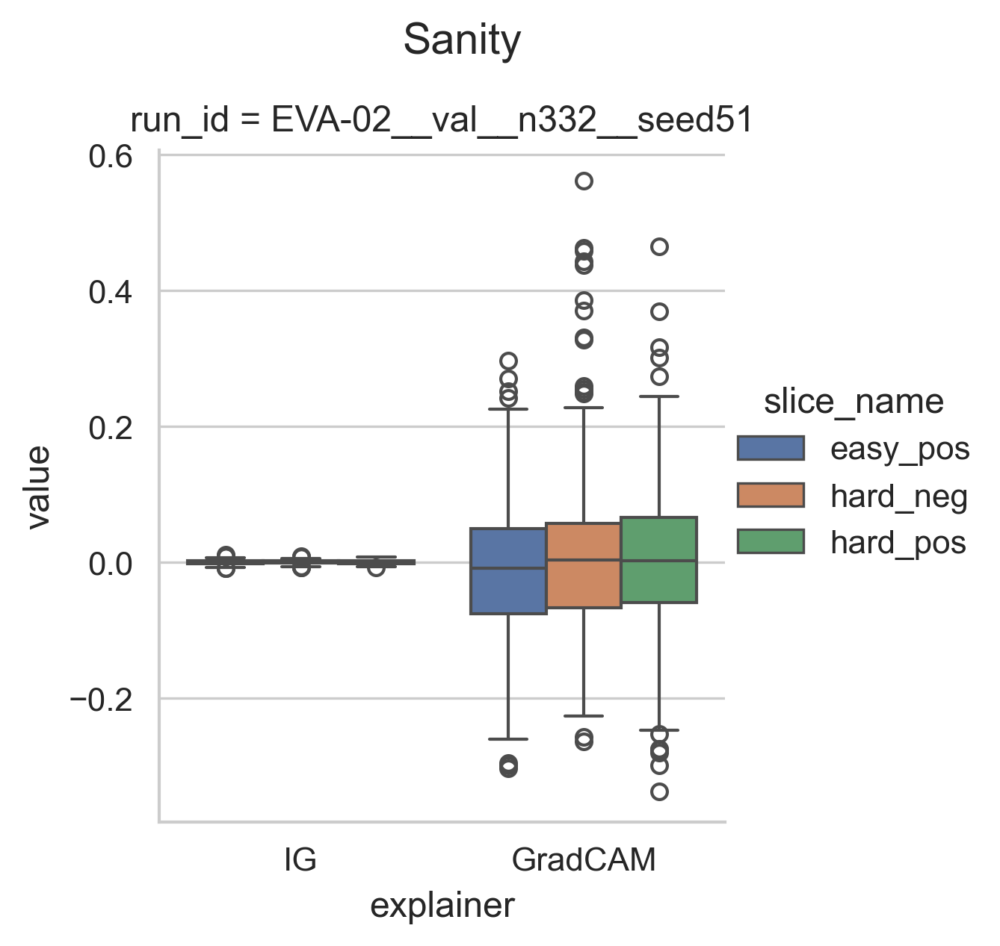
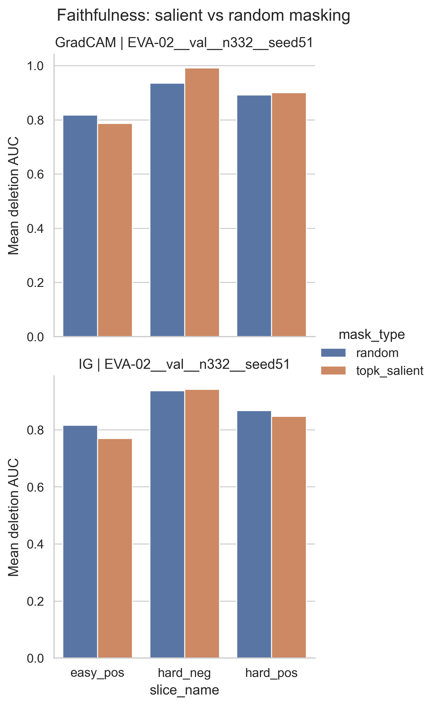
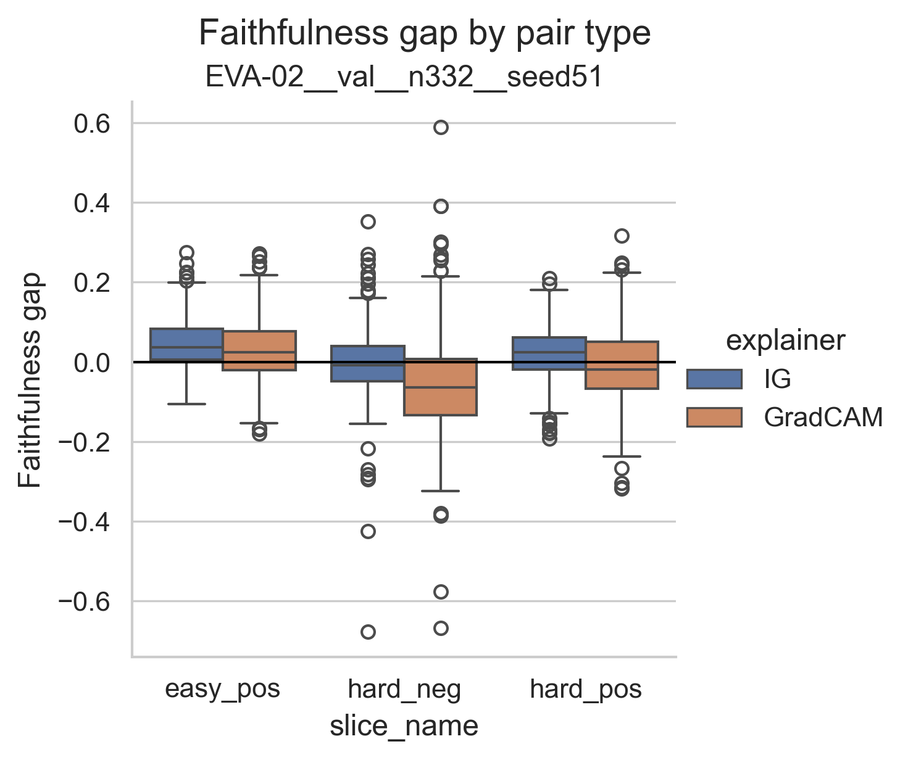
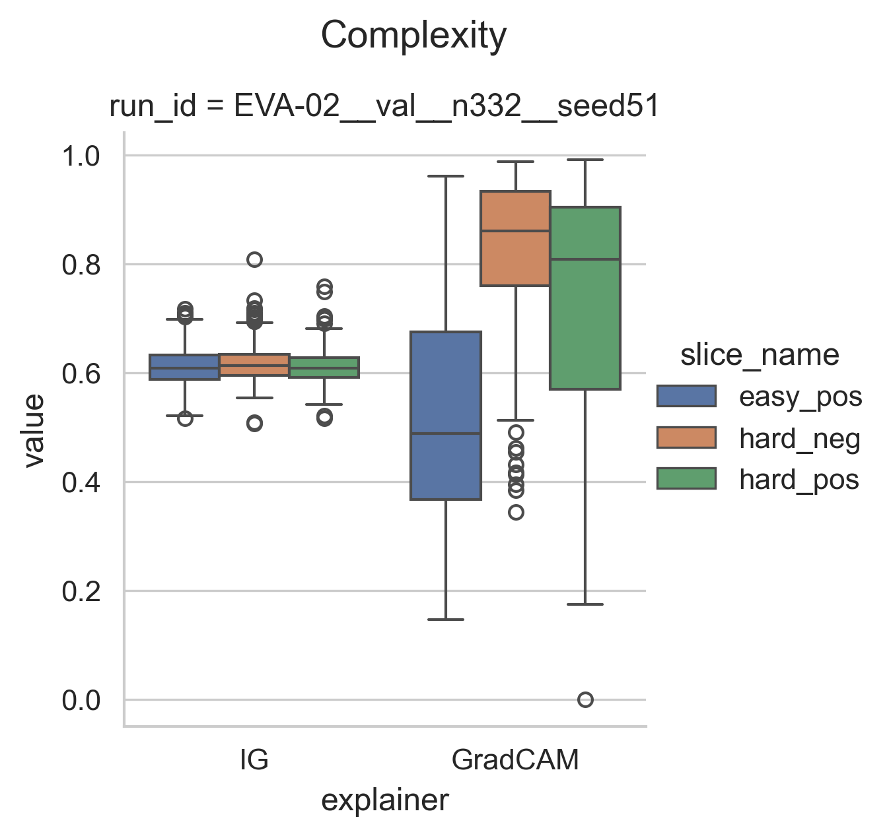

# E16 XAI Metrics Follow-up Experiments (Data - Round 1)

**Experiment Group:** Interpretability analyses

This document contains the quantitative XAI follow-up analyses for Round 1. It complements the main qualitative explanation experiments by evaluating explanation quality and explainer choice.

- **E16.1** follows up on *E15 (Q31) Pairwise Similarity Explanations* and evaluates pairwise-similarity explanations with sanity, faithfulness, and complexity metrics.
- **E16.2** follows up on *E14 (Q2) Class Attributions* and compares GradCAM and IG for class attributions.

Together, these two subexperiments make up the XAI metrics section of the interpretability analysis.

## E16.1 Interpretability Sanity / Faithfulness Experiment (Data - Round 1)
*(Subexperiment of E15 (Q31) Pairwise Similarity Explanations)*

**Experiment Group:** Interpretability analyses

### Main Research Question
----------------------

Are the pairwise-similarity explanations from **EVA-02** actually tied to the learned model and meaningfully related to the similarity score, or are they only visually plausible?

This experiment is the **quantitative follow-up to E15**. In **E15**, the pairwise maps looked qualitatively coherent and mostly jaguar-centered. Here, the goal is to test that impression more systematically with three complementary checks:

1. **sanity**: do maps change when the model is randomized?
2. **faithfulness**: does masking the most salient region reduce similarity more than random masking?
3. **complexity**: are the maps spatially concentrated or diffuse, and does that change across pair types?

### Setup / Intervention
--------------------

We evaluated pairwise similarity explanations for the fixed trained model **EVA-02** on the same validation subset used in **E15** (**332 pairs per slice**). Two explainers were compared:

- **Integrated Gradients (IG)**
- **GradCAM**

The evaluation was carried out separately for the three pair types introduced in **E15**:

- **easy positives**
- **hard negatives**
- **hard positives**

This makes it possible to test whether explanation quality changes exactly in the regimes that were qualitatively most important in the previous experiment.

### Method / Procedure
------------------

Three metrics were computed.

**Sanity.** For each pair, the saliency map from the trained model was compared with the corresponding map from a randomized model. A larger deviation indicates that the explanation is more sensitive to the learned parameters.

**Faithfulness.** For each pair, the top-salient region was masked and compared against a random mask of the same size. We then measured the resulting deletion AUC of the similarity score. In this document, the **faithfulness gap** is defined as:

`faithfulness gap = deletion AUC (random mask) - deletion AUC (top-k salient mask)`

A **positive** gap therefore means that masking salient regions hurts similarity **more** than random masking, which is the desired direction.

**Complexity.** A complexity score was used to characterize how concentrated or diffuse the saliency support is. Under this metric, **higher values indicate more spatially diffuse maps**.

In addition to descriptive summaries, inter-explainer differences were compared with **Mann–Whitney U tests** for each pair type and metric.

### Quantitative Explanation Evaluation
----------------------------------------------

#### Evaluation

The quantitative results partly support the qualitative interpretation from **E15**, but they also show clear limits. The main pattern is consistent across metrics: the explanations are most defensible for **easy positives** and weakest for **hard negatives**, i.e. exactly the regime where retrieval errors are most diagnostic.

##### Sanity

The sanity results are weak overall.

For **IG**, the sanity mean is essentially zero in all three pair types: **-0.0001** for easy positives, **0.0000** for hard negatives, and **0.0002** for hard positives. The spread is also extremely small (**± 0.003** throughout). In practice, this means that IG changes very little under model randomization in this setup.

**GradCAM** shows a broader distribution and somewhat larger excursions, but the central tendency still remains close to zero: **-0.014 ± 0.102** for easy positives, **0.005 ± 0.116** for hard negatives, and **0.002 ± 0.108** for hard positives. The boxplots in **Figure 1** therefore suggest that GradCAM is somewhat more sensitive to randomization than IG, but the effect is still modest overall rather than strong.

This is important for how the qualitative maps from **E15** should be read. The maps may look plausible, but sanity alone does not provide strong evidence that either explainer is tightly anchored to the learned weights in this specific pairwise setup.

<em>Figure 1. Sanity distributions by explainer and pair type for EVA-02. IG remains almost exactly at zero, while GradCAM shows broader but still small deviations.</em>

##### Faithfulness

Faithfulness depends strongly on pair type.

For **easy positives**, both explainers show a small positive gap, which is the expected direction. The mean gap is **0.046 ± 0.060** for **IG** and **0.031 ± 0.083** for **GradCAM**. This means that, on average, top-salient masking reduces similarity more than random masking. The barplots in **Figure 2** show the same pattern directly: for easy positives, the mean deletion AUC is lower under top-k salient masking than under random masking for both explainers (**IG: 0.770 vs. 0.816; GradCAM: 0.787 vs. 0.817**).

For **hard negatives**, the picture deteriorates. **IG** is almost neutral with a slightly negative mean gap (**-0.005 ± 0.091**), whereas **GradCAM** becomes clearly negative (**-0.057 ± 0.126**). This means that in the hardest error-prone regime, masking the supposedly most relevant region is not better than random masking on average, and for GradCAM it is substantially worse.

For **hard positives**, **IG** remains slightly positive (**0.020 ± 0.067**), but **GradCAM** is again slightly negative (**-0.009 ± 0.096**). Thus, the positive faithfulness signal does not generalize cleanly beyond the easy-positive regime.

The faithfulness-gap distributions in **Figure 3** make the same pattern clear. Easy positives are shifted upward, especially for IG. Hard negatives are centered around zero for IG but below zero for GradCAM, with a wide spread and several large negative outliers. Hard positives lie in between.

<em>Figure 2. Mean deletion AUC under random vs. top-k salient masking. Lower top-k AUC than random AUC is desirable because it indicates that salient masking reduces similarity more strongly.</em>

<em>Figure 3. Faithfulness-gap distributions by pair type and explainer. Easy positives show the clearest positive gap; hard negatives are weakest and become clearly negative for GradCAM.</em>

This directly refines the interpretation from **[E15 (Q31) Pairwise Similarity Explanations](E15_eda_xai_similarity.md)**. There, the hard-negative maps looked visually plausible and jaguar-centered. Here we see that this visual plausibility is not matched by strong faithfulness evidence. In other words, the hard-negative explanations may look reasonable, but they are not reliably supported by masking behavior.

##### Complexity

The complexity metric shows the clearest separation between the two explainers.

**IG** is highly stable across pair types, with mean complexity values of **0.612** for easy positives, **0.618** for hard negatives, and **0.612** for hard positives. The distributions are narrow, indicating that IG produces similarly structured maps across all three regimes.

**GradCAM** behaves very differently. For **easy positives**, its mean complexity is **0.525 ± 0.192**, which is actually **lower** than IG and therefore more spatially concentrated on average. But for difficult pairs, GradCAM becomes much more diffuse: **0.827 ± 0.131** for hard negatives and **0.724 ± 0.219** for hard positives. This is exactly the pattern suggested qualitatively in **E15**, where GradCAM-like evidence in difficult cases appeared broader and less localized.

The difference is visible in **Figure 4** and also strongly supported statistically: the IG–GradCAM complexity difference is significant in all three pair types (**p < 10^-12** in each case).

<em>Figure 4. Complexity distributions by explainer and pair type. IG remains stable, whereas GradCAM is compact for easy positives but much more diffuse for hard negatives and hard positives.</em>

#### Statistical Comparison Between Explainers

The inter-explainer comparison sharpens the descriptive picture.

For **faithfulness gap**, **IG** is significantly stronger than **GradCAM** in all three regimes: easy positives (**0.046 vs. 0.031**, **p = 0.0011**), hard negatives (**-0.005 vs. -0.057**, **p < 10^-14**), and hard positives (**0.020 vs. -0.009**, **p < 10^-7**). The strongest separation appears in the hard-negative regime, where GradCAM becomes clearly worse.

For the raw deletion-AUC components, the explainers are almost indistinguishable under **random masking** for easy positives and hard negatives, but **GradCAM** yields significantly larger AUC than **IG** for hard positives (**0.892 vs. 0.867**, **p = 0.0033**). Under **top-k masking**, **GradCAM** is worse than **IG** in all three pair types, especially for hard negatives (**0.992 vs. 0.941**, **p < 10^-5**) and hard positives (**0.901 vs. 0.847**, **p < 10^-8**). Since lower top-k AUC is preferable, this again favors **IG**.

For **sanity**, the only significant inter-explainer difference appears in easy positives (**p = 0.0476**), but both means remain very close to zero. For hard negatives and hard positives, the IG–GradCAM sanity difference is not significant.

Overall, the statistical tests do not overturn the descriptive reading; they strengthen it. The most robust difference between the explainers is not in sanity, but in the combination of **faithfulness** and especially **complexity**.

#### Key Result / Takeaway

The quantitative evaluation supports a **cautious interpretation** of the pairwise maps from **E15**.

Three findings matter most.

First, **sanity is weak overall**, especially for **IG**, whose values remain almost exactly zero under model randomization. GradCAM is somewhat more responsive, but the effect is still small.

Second, **faithfulness is most convincing only for easy positives**. In that regime, both explainers show a small positive gap, consistent with meaningful attribution. But this support weakens or disappears in the difficult regimes, especially for **hard negatives**, where **GradCAM** becomes clearly negative and **IG** is only approximately neutral.

Third, **complexity separates the explainers clearly**. **IG** is stable across pair types, whereas **GradCAM** becomes much more diffuse in the difficult regimes that matter most for retrieval failure analysis.

Taken together with **E15**, the most defensible conclusion is: pairwise explanations are **most trustworthy in easy matching settings**, but they become substantially less reliable in the hard-negative regime where interpretability would be most valuable.

### Main Results Table
------------------

**Table 1. Summary of sanity, faithfulness, and complexity results for EVA-02.**

| model | explainer | pair_type | complexity | faith_gap | faith_random | faith_topk | sanity |
|---|---|---|---:|---:|---:|---:|---:|
| EVA-02 | GradCAM | easy_pos | 0.525 ± 0.192 | 0.031 ± 0.083 | 0.817 ± 0.086 | 0.787 ± 0.091 | -0.014 ± 0.102 |
| EVA-02 | GradCAM | hard_neg | 0.827 ± 0.131 | -0.057 ± 0.126 | 0.935 ± 0.155 | 0.992 ± 0.153 | 0.005 ± 0.116 |
| EVA-02 | GradCAM | hard_pos | 0.724 ± 0.219 | -0.009 ± 0.096 | 0.892 ± 0.114 | 0.901 ± 0.122 | 0.002 ± 0.108 |
| EVA-02 | IG | easy_pos | 0.612 ± 0.034 | 0.046 ± 0.060 | 0.816 ± 0.083 | 0.770 ± 0.104 | -0.000 ± 0.003 |
| EVA-02 | IG | hard_neg | 0.618 ± 0.035 | -0.005 ± 0.091 | 0.936 ± 0.156 | 0.941 ± 0.198 | 0.000 ± 0.003 |
| EVA-02 | IG | hard_pos | 0.612 ± 0.032 | 0.020 ± 0.067 | 0.867 ± 0.093 | 0.847 ± 0.130 | 0.000 ± 0.003 |

### Overall Conclusion
------------------

This experiment provides the quantitative validation that was deferred from **E15**.

The pairwise explanations are **not uniformly reliable** across settings. Their strongest support appears in **easy positives**, where the maps are consistent with a small but positive faithfulness signal. However, this support weakens substantially for the difficult pair types. In particular, **hard negatives**—the most relevant regime for understanding retrieval errors—show little or no convincing faithfulness evidence, and **GradCAM** becomes both more negative in faithfulness gap and markedly more diffuse in complexity.

The sanity results further reinforce a cautious reading. **IG** is extremely stable, but almost too stable: it changes very little under randomization. **GradCAM** is more responsive, yet that responsiveness remains modest and is not accompanied by strong faithfulness in the difficult regimes.

Overall, the quantitative analysis partly supports the qualitative conclusion from **E15**—namely that the maps are often jaguar-centered and visually plausible—but it also places an important limit on that interpretation: **visual plausibility should not be confused with robust explanation quality**. The pairwise explanations are most defensible in easy matching settings and appreciably less trustworthy for the hard cases that matter most for retrieval failure analysis.

### Main Findings
-------------

- This experiment is the **quantitative companion to E15** and evaluates the same EVA-02 pairwise-similarity setting.
- **IG sanity is essentially zero** across all pair types, so it shows almost no change under model randomization in this setup.
- **GradCAM sanity is somewhat broader**, but its central tendency also remains close to zero.
- **Faithfulness is strongest for easy positives**: IG (**0.046**) and GradCAM (**0.031**) both show a positive mean gap.
- **Hard negatives are weakest**: IG is nearly neutral (**-0.005**), while GradCAM becomes clearly negative (**-0.057**).
- **IG remains slightly positive for hard positives** (**0.020**), whereas **GradCAM** is slightly negative (**-0.009**).
- **IG complexity is very stable** at about **0.61** across all pair types.
- **GradCAM complexity changes strongly by regime**: it is relatively compact for easy positives (**0.525**) but much more diffuse for hard negatives (**0.827**) and hard positives (**0.724**).
- The most robust inter-explainer differences appear in **faithfulness gap** and **complexity**, where **IG** is consistently better or more stable than **GradCAM**.

### Limitation
----------

This evaluation covers **one model (EVA-02)**, **one validation subset**, and **one specific pair-sampling setup**. The quantitative results are therefore informative for the analyzed pairwise-similarity experiment, but they should not automatically be generalized to all models, all explainers, or all retrieval settings. In addition, the sanity effect is weak overall, so the conclusions mainly rest on the combination of faithfulness and complexity rather than on a strong randomization signal alone.

----------------------------------------

## E16.2 (Q2a) Explainer Comparison for Class Attributions (GradCAM vs IG)
*(Subexperiment of E14 (Q2) Class Attributions)*

**Experiment Group:** Interpretability analyses

### Main Research Question
---------------------------------------------------
How do **GradCAM** and **Integrated Gradients (IG)** compare for EVA-02 class attributions, quantitatively and qualitatively, and does explainer choice materially affect the interpretation?

### Relation to the Main Class-Attribution Experiment
---------------------------------------------------
This document is a methodological follow-up to **[E14 (Q2) Class Attributions](E14_eda_xai_class_attribution.md)**. It revisits the same quantitative summaries and qualitative overlays, but with a narrower goal: not to ask what the explanations suggest about the model, but rather **which explainer is more useful and how much the overall interpretation depends on explainer choice**.

### Setup
---------------------------------------------------
We compare **GradCAM** and **Integrated Gradients (IG)** on the same class-attribution outputs used in the main experiment. The comparison is based on:

- **sanity** under randomization,
- **faithfulness gap** and masking effects,
- **complexity**,
- and **qualitative plausibility** of the resulting overlays.

The figures shown below are re-used from the main class-attribution analysis and are included again here for clarity. Their interpretation, however, is now explicitly methodological.

### Main Findings
---------------------------------------------------
The broad interpretation is stable across explainer choice: both methods support the same overall conclusion already established in **[# E14 (Q2) Class Attributions](E14_eda_xai_class_attribution.md)**, namely that sanity is acceptable but masking-based faithfulness is weak.

At the same time, the two explainers differ materially in usability:

- **GradCAM** yields slightly stronger quantitative results on the masking-based metrics.
- **IG** is consistently more diffuse, both numerically and visually.
- As a result, **GradCAM is the more useful explainer in this setting**, even though neither method provides strong faithfulness evidence.

### Quantitative Comparison
---------------------------------------------------
The aggregate metric plots from the main experiment are reproduced below because they already contain the key evidence for the explainer comparison.

<em>Figure 1. Mean class-attribution metrics by group and explainer, reproduced from the main class-attribution experiment.</em>

<em>Figure 2. Distribution of sanity, faithfulness gap, and complexity by group and explainer, reproduced from the main class-attribution experiment.</em>

Figure 1 already shows the main quantitative pattern. The two explainers are very similar on **sanity**, but differ more clearly on **faithfulness gap** and **complexity**. GradCAM has the larger mean faithfulness gap in the two main groups, whereas IG has higher complexity.

Figure 2 shows that these differences are not just artifacts of the mean. The sanity distributions overlap substantially, while the faithfulness-gap and complexity distributions are more clearly separated.

The masking comparison from the main experiment is also directly relevant here, because it shows whether one explainer identifies more decision-relevant regions than the other.

<em>Figure 3. Mean target-score drop under top-k salient masking versus random masking, reproduced from the main class-attribution experiment.</em>

<em>Figure 4. Distribution of faithfulness gaps by group and explainer, reproduced from the main class-attribution experiment.</em>

Figures 3 and 4 show that **GradCAM performs somewhat better than IG on the same weak-faithfulness landscape**. In `all` and `orig_rank1_correct`, GradCAM produces a slightly larger positive gap than IG, but the absolute magnitudes remain small. This means the correct interpretation is not that GradCAM is strongly faithful, but rather that it is **relatively better under otherwise weak masking-based evidence**.

**Table 1. Mann–Whitney comparison of GradCAM and IG on the main class-attribution metrics.**

| group | metric | mean GradCAM | mean IG | p-value | significance |
|---|---|---:|---:|---:|---|
| all | sanity | -0.0085 | 0.0001 | 0.4582 | ns |
| orig_rank1_correct | sanity | -0.0293 | -0.0001 | 0.2397 | ns |
| all | faith_gap | 0.0019 | 0.0005 | 0.0007 | *** |
| orig_rank1_correct | faith_gap | 0.0019 | 0.0005 | 0.0009 | *** |
| all | faith_topk | 0.0006 | -0.0008 | 0.0020 | ** |
| orig_rank1_correct | faith_topk | 0.0007 | -0.0007 | 0.0019 | ** |
| all | complexity | 0.5785 | 0.6044 | 0.0017 | ** |
| orig_rank1_correct | complexity | 0.5790 | 0.6041 | 0.0022 | ** |

Table 1 clarifies the same picture statistically. The sanity difference is **not significant**, so sanity does not clearly favor either method. By contrast, GradCAM has a significantly larger **faithfulness gap** and significantly less **complexity** in the two main groups. These differences are meaningful for explainer comparison, even if they do not change the overall conclusion that faithfulness remains weak in absolute terms.

### Qualitative Comparison
---------------------------------------------------
The qualitative overlays from the main experiment are reproduced below because the difference between the two explainers is even clearer visually than numerically.

<em>Figure 5. Qualitative class-attribution overlays for the `all` group, reproduced from the main class-attribution experiment.</em>

<em>Figure 6. Qualitative class-attribution overlays for the `orig_rank1_wrong` group, reproduced from the main class-attribution experiment.</em>

As seen in Figure 5, **GradCAM** more often produces a coarse but semantically plausible jaguar-centered emphasis, especially on the **head, torso, flank, and coat pattern**. **IG**, by contrast, is typically much more **diffuse, texture-like, and globally noisy**. The jaguar silhouette is sometimes still visible, but the map is less selective and harder to interpret as a compact class-attribution explanation.

Figure 6 points in the same direction for the hard-case subset. Even there, GradCAM remains more visually interpretable than IG, although neither explainer isolates the class evidence especially cleanly.

### Overall Answer
---------------------------------------------------
The overall interpretation does **not** depend strongly on the explainer: both methods support the same broad conclusion from the main class-attribution experiment, namely that sanity is acceptable but masking-based faithfulness is weak.

However, the comparison does matter in practice. **GradCAM is preferable to IG in this setting**, because it yields slightly stronger quantitative results and substantially more interpretable qualitative overlays.

### Concise Conclusion
---------------------------------------------------
This methodological follow-up shows that the class-attribution conclusions are broadly stable across explainer choice, but the **quality of interpretation is not**. GradCAM is the more useful explainer for EVA-02 class attributions: it performs somewhat better on the masking-based metrics and produces more semantically plausible overlays than IG. That said, neither explainer provides strong faithfulness evidence in absolute terms.
