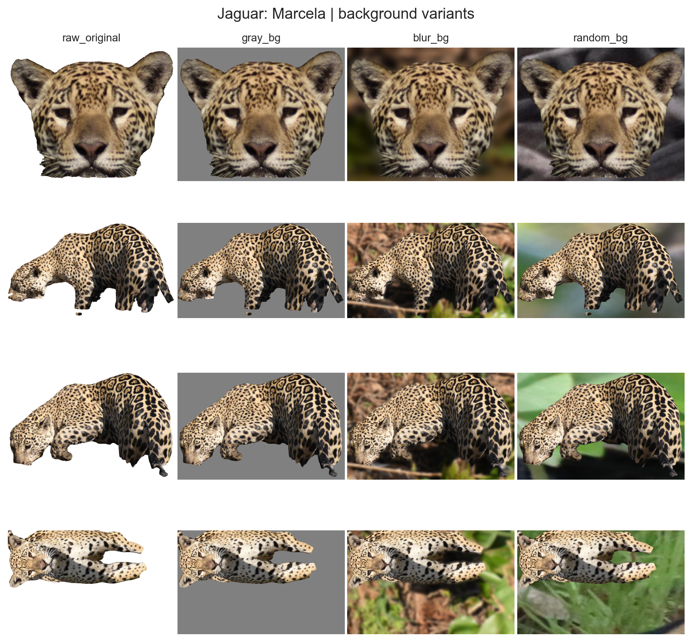
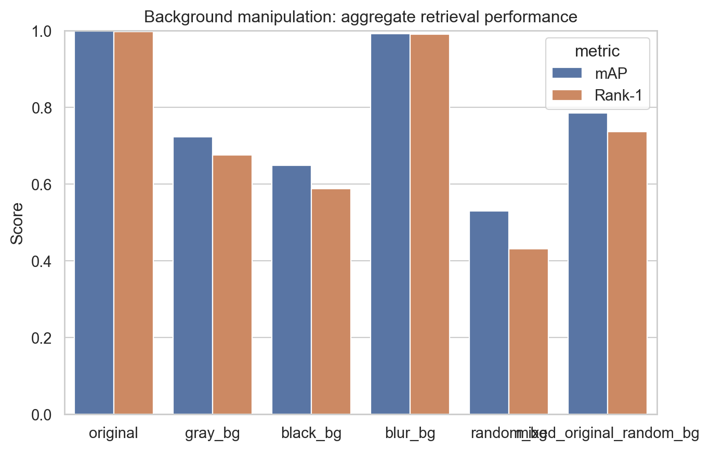
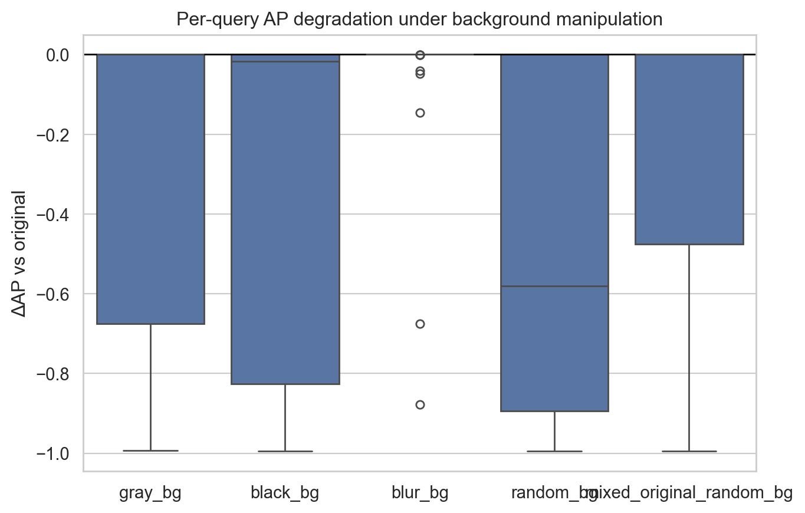

# E0X (Q1) Background Intervention (Data - Round 1)

**Experiment Group:** Robustness and diagnostic experiments

## Main Research Question
How robust is retrieval performance to different query-side background interventions?

---

## Intervention
To isolate the effect of background context at inference time, we kept the trained model and the gallery fixed and modified only the query background. The model was trained on the original round_1 images, while evaluation was performed under six query settings: `original`, `gray_bg`, `black_bg`, `blur_bg`, `random_bg`, and `mixed_original_random_bg`.

The gallery was built from the validation split in the original condition, and all manipulated query variants were retrieved against this same fixed gallery. Exact self-matches were excluded during evaluation, and same-burst matches were also removed to avoid trivial near-duplicate retrieval. The goal of this setup is therefore to measure how strongly retrieval changes when only the query-side background is altered.

<em>example query background variants.</em>

## Important evaluation note
The absolute retrieval scores in the `original` condition are extremely high (**mAP = 0.998**, **Rank-1 = 0.997**). These values should be interpreted with care. Most importantly, evaluation is restricted to queries that still have at least one valid positive in the gallery after filtering. Queries without any remaining valid positive are skipped. As a result, the absolute scores here reflect the **evaluable subset** of validation queries under this controlled protocol and are not directly comparable to the standard validation score reported during training.

For this reason, the key signal in this experiment is the **relative degradation across interventions**, not the absolute ceiling-level baseline.

## Main Findings
-------------

* **Best condition:** **original**, with **mAP = 0.998** and **Rank-1 = 0.997**.
* **blur_bg** is by far the least harmful intervention and remains nearly identical to the original setting (**ΔmAP = -0.006**, **ΔRank-1 = -0.006**).
* The strongest degradation is observed under **random_bg**, with **ΔmAP = -0.469** and **ΔRank-1 = -0.567**.
* **black_bg** and **gray_bg** also cause substantial drops, while **mixed_original_random_bg** is harmful but less severe than full random replacement.
* Overall, the relative pattern is clear: retrieval is **not fully invariant** to background manipulation.

## Main Results Table
------------------

| setting | mAP | Rank-1 | ΔmAP vs original | ΔRank-1 vs original |
|----------|-----:|-------:|-----------------:|--------------------:|
| original | 0.998 | 0.997 | 0.000 | 0.000 |
| blur_bg | 0.992 | 0.991 | -0.006 | -0.006 |
| mixed_original_random_bg | 0.785 | 0.737 | -0.212 | -0.260 |
| gray_bg | 0.723 | 0.675 | -0.274 | -0.322 |
| black_bg | 0.648 | 0.588 | -0.350 | -0.409 |
| random_bg | 0.529 | 0.430 | -0.469 | -0.567 |

<em>Bar plot of aggregate mAP and Rank-1 across settings.</em>

### Aggregate performance analysis

The ordering of intervention severity is consistent and easy to interpret. **blur_bg** leaves retrieval almost unchanged, whereas **random_bg** causes the strongest degradation by a large margin. **black_bg** and **gray_bg** are also clearly harmful, and **mixed_original_random_bg** lies in between.

This pattern suggests that the model is not equally sensitive to all background changes. Performance remains stable when coarse scene structure is preserved by blurring, but drops strongly when the original context is removed or replaced. The main issue is therefore not background change per se, but **context replacement**.

## Per-Query Diagnostics
---------------------

To assess whether the degradation is broad-based or driven by a subset of unstable queries, we also analyzed per-query changes relative to the original condition.

| setting | mean ΔAP vs original | median ΔAP vs original | rank-1 flip rate | mean Δ first positive rank |
|----------|---------------------:|-----------------------:|-----------------:|---------------------------:|
| blur_bg | -0.006 | 0.000 | 0.006 | 0.046 |
| mixed_original_random_bg | -0.212 | 0.000 | 0.260 | 8.731 |
| gray_bg | -0.274 | 0.000 | 0.322 | 12.362 |
| black_bg | -0.350 | -0.017 | 0.409 | 16.437 |
| random_bg | -0.469 | -0.581 | 0.567 | 19.495 |

[PLACEHOLDER: ]

<em>Boxplot of per-query ΔAP vs original.</em>

### Rank-1 stability

The per-query analysis shows two main regimes.

* **blur_bg** is almost perfectly stable. The median ΔAP is **0.000**, the mean ΔAP is only **-0.006**, and the rank-1 flip rate is **0.6%**.
* **random_bg** causes the clearest systematic failures. Its median ΔAP is **-0.581**, and the rank-1 flip rate reaches **56.7%**, showing that the degradation affects a large share of queries rather than only a few outliers.
* **black_bg** also causes substantial failures, though less consistently than random replacement.
* **gray_bg** and **mixed_original_random_bg** show a mixed pattern: many queries remain stable, but a substantial subset degrades strongly.

## Interpretation
--------------

### Which query background manipulations are most harmful to jaguar Re-ID retrieval?

The most harmful manipulation is **random_bg**, followed by **black_bg**, **gray_bg**, and **mixed_original_random_bg**, while **blur_bg** is largely harmless. This ordering is consistent across both aggregate metrics and per-query diagnostics.

The main implication is that **replacing the original context is much more damaging than merely degrading it**. Blurring preserves coarse scene information, whereas black, gray, and especially random replacement remove or overwrite it.

### Do background manipulations induce systematic rank-1 failures or only mild score degradation?

This depends on the manipulation.

* **blur_bg** causes only negligible degradation.
* **random_bg** induces a clear **systematic rank-1 failure mode**, not just a mild score drop.
* **black_bg** also causes many rank-1 failures.
* **gray_bg** and **mixed_original_random_bg** show a mixed regime with both stable and strongly degraded queries.

Thus, severe interventions do not just lower similarity slightly; they often change the retrieval outcome itself.

### Does performance degradation under query-side background manipulations indicate that retrieval is not fully invariant to background context?

Yes. The relative degradation pattern provides strong evidence that retrieval is **not fully background-invariant**.

If retrieval depended only on jaguar appearance, changing the background while keeping the foreground fixed should have had little effect. Instead, several interventions lead to large drops, especially **random_bg**, **black_bg**, and **gray_bg**. At the same time, the near-original performance under **blur_bg** shows that the model is not simply fragile to any perturbation. It is specifically sensitive when the original context is removed or replaced.

## Limitation
----------

This experiment provides clear evidence of sensitivity to altered context, but it does not fully separate true background reliance from artifacts introduced by the interventions themselves. In particular, **black_bg**, **gray_bg**, and **random_bg** are somewhat artificial manipulations. In addition, the absolute baseline should be interpreted cautiously because evaluation is restricted to queries with at least one valid positive after filtering.

## Conclusion
----------

The background intervention experiment shows that jaguar Re-ID retrieval is **not fully robust** to query-side background manipulation. Performance remains almost unchanged under **blur_bg**, but drops substantially under **gray_bg**, **black_bg**, and especially **random_bg**.

Overall, the most important result is the **relative ordering of interventions**: retrieval is robust to mild degradation of the original context, but clearly sensitive when that context is removed or replaced. This indicates that the model is **partially background-dependent rather than fully background-invariant**.