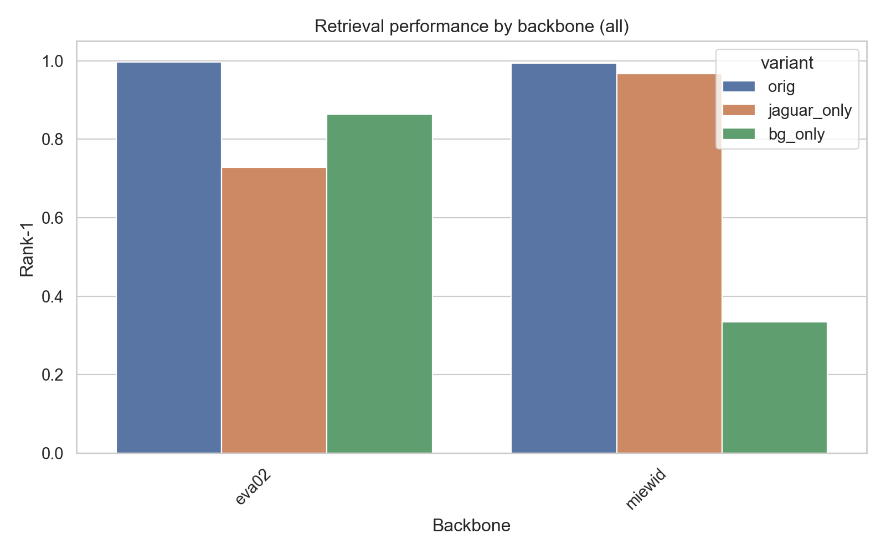
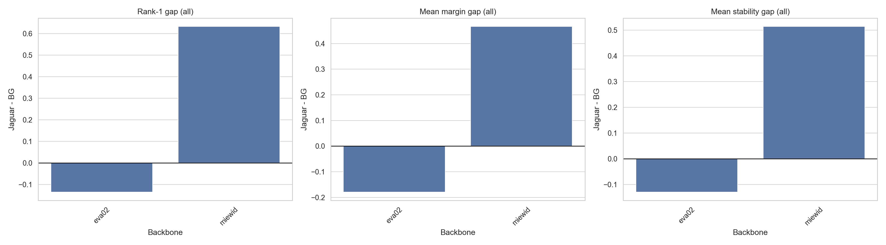
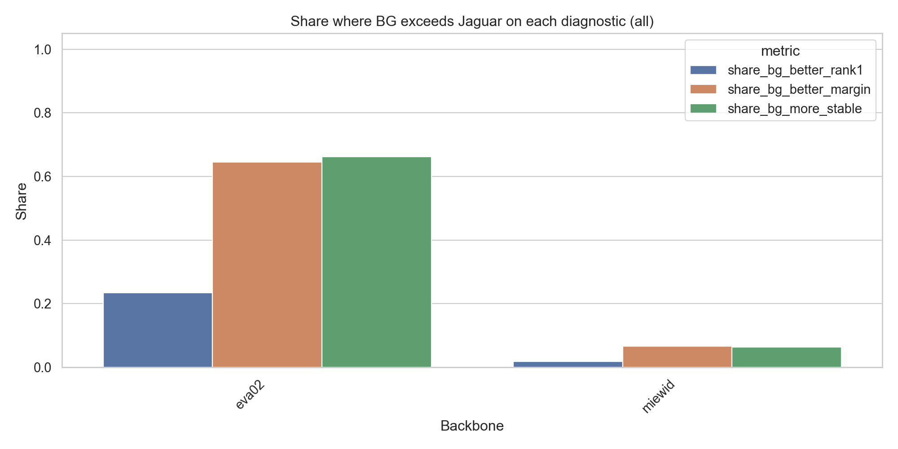
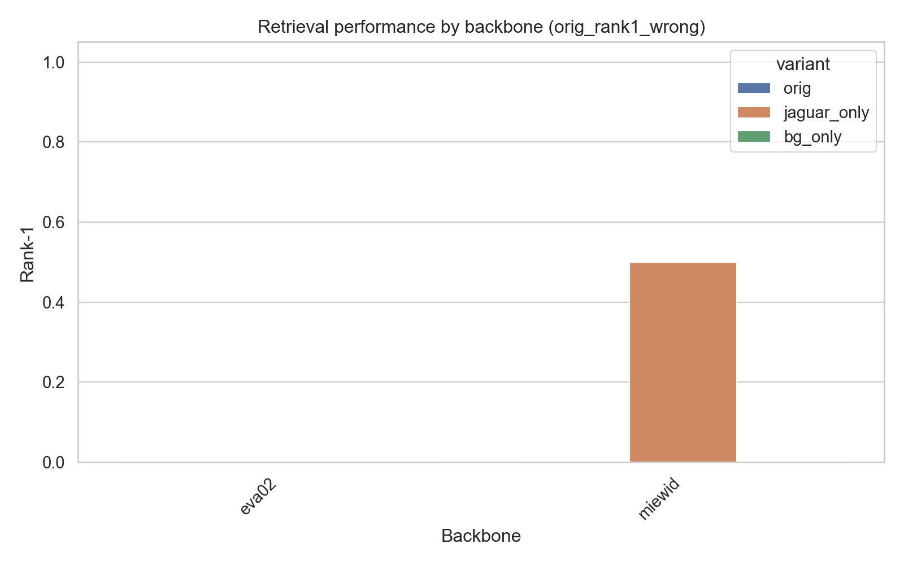
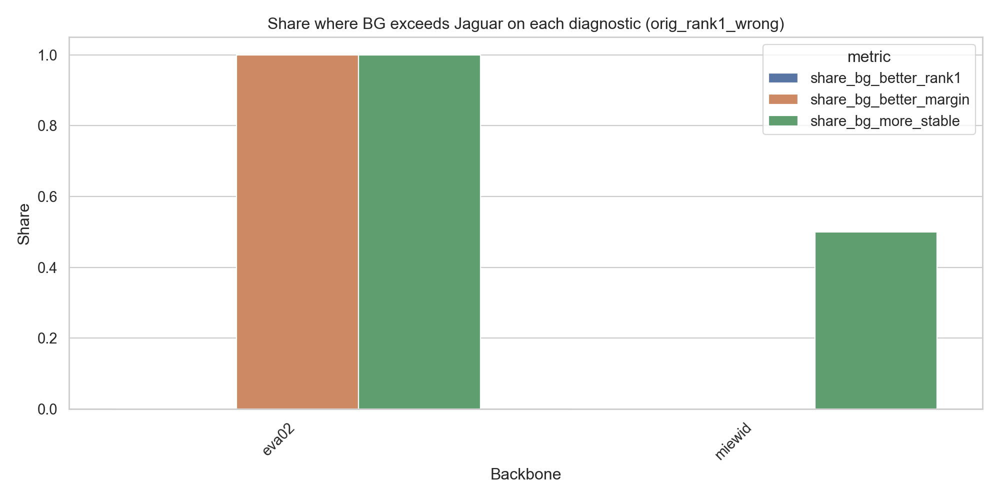
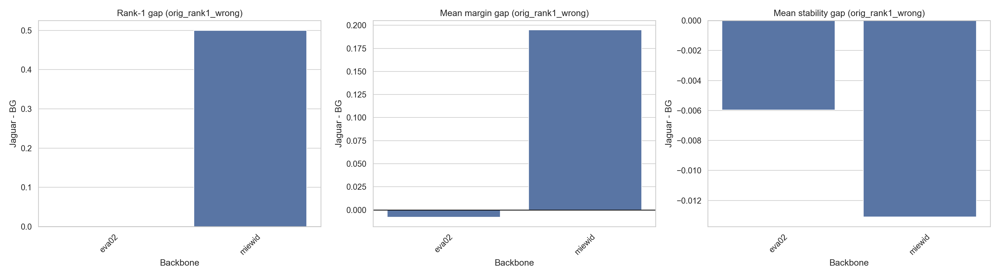

# E0X (Q0) Foreground vs Background Contribution Analysis (Data - Round 1)

**Experiment Group:** Robustness and diagnostic experiments

## Main Research Question
-----------------------------------------------------
Is retrieval-relevant identity signal preserved more in the jaguar region or in the background?

*Does Jaguar Re-ID retrieval depend primarily on jaguar appearance, or does background context retain substantial retrieval-useful signal? How much signal is retained in jaguar-only versus background-only query views, and does retrieval rely more on foreground identity cues or on contextual background cues?*

### Secondary Research Questions
- Classification sensitivity: does true-class confidence drop more when jaguar is removed or when background is removed?
- Are background effects stronger for cases the model already gets wrong?
- Embedding stability: does the embedding remain closer to the original image when only the jaguar is retained or when only the background is retained?

## Experimental Setup
-----------------------------------------------------
Each query was decomposed into three variants: `orig`, `jaguar_only`, and `bg_only`.

The gallery was kept fixed. We then compared the three query variants for each backbone using:
- retrieval performance, especially Rank-1
- retrieval margin
- embedding stability relative to the original query embedding
- error-split analyses for `all`, `orig_rank1_correct`, and `orig_rank1_wrong`

The core intervention is therefore simple: remove either the foreground or the background and test which view still preserves retrieval-relevant signal.

## Main Findings
-----------------------------------------------------
The results show a clear **backbone-dependent difference** in foreground/background reliance.

- **MiewID** is strongly **foreground-dominant**. Removing the background leaves retrieval largely intact, whereas removing the jaguar causes a severe collapse.
- **EVA02** is much more **background-sensitive**. In this model, `bg_only` queries outperform `jaguar_only` queries, indicating that contextual information contributes substantially to retrieval.
- The answer to the main research question is therefore **not uniform across models**: for MiewID, the relevant signal is preserved mainly in the jaguar region, whereas for EVA02 the background retains unexpectedly strong **retrieval-useful contextual signal**.
- This background effect should not be interpreted as evidence that identity is literally encoded in the background itself. Rather, in a burst-heavy dataset, strong `bg_only` performance likely reflects **correlated capture context** that remains stable across near-duplicate images and can act as a shortcut for retrieval.

## Main Results
-----------------------------------------------------
| backbone_name | head_type | orig_rank1 | jaguar_only_rank1 | bg_only_rank1 | rank1_gap_jag_minus_bg | share_bg_better_rank1 | orig_mean_margin | jaguar_only_mean_margin | bg_only_mean_margin | margin_gap_jag_minus_bg | share_bg_better_margin |
|---|---|---:|---:|---:|---:|---:|---:|---:|---:|---:|---:|
| eva02 | triplet | 0.9970 | 0.7289 | 0.8645 | -0.1355 | 0.2349 | 0.6657 | 0.1704 | 0.3497 | -0.1793 | 0.6446 |
| miewid | triplet | 0.9940 | 0.9669 | 0.3343 | 0.6325 | 0.0181 | 0.4469 | 0.3537 | -0.1129 | 0.4666 | 0.0663 |

Across the full evaluation set, original performance is near-perfect for both backbones, so the relevant question is not whether retrieval works in the original setting, but **which information source remains predictive after masking**.

For **MiewID**, `jaguar_only` preserves most of the original retrieval signal (`0.967` Rank-1), while `bg_only` drops sharply (`0.334`). The jaguar-minus-background Rank-1 gap is strongly positive (`+0.633`), and the same is true for the margin gap (`+0.467`). Background-only queries outperform jaguar-only queries only rarely (`1.8%` of cases for Rank-1 and `6.6%` for margin). This indicates that MiewID relies primarily on the **animal region** for identity matching.

For **EVA02**, the pattern is reversed. `jaguar_only` drops to `0.729` Rank-1, but `bg_only` still reaches `0.864`, clearly outperforming the jaguar crop. The jaguar-minus-background Rank-1 gap is negative (`-0.136`), and the margin gap is also negative (`-0.179`). Moreover, background-only queries outperform jaguar-only queries in `23.5%` of cases for Rank-1 and in `64.5%` of cases for margin. This indicates substantial **context dependence**.

Overall, MiewID behaves as the more desirable Re-ID model: retrieval remains centered on the jaguar crop. EVA02, by contrast, appears to rely much more on contextual structure, which is undesirable in a Re-ID setting because it reduces invariance to background.

| backbone | jaguar_only mean gold rank | bg_only mean gold rank | share bg more stable |
|---|---:|---:|---:|
| eva02 | 12.74 | 4.43 | 0.663 |
| miewid | 1.38 | 44.83 | 0.063 |

The fuller retrieval summary shows that this pattern is not limited to Rank-1. For **EVA02**, `bg_only` also outperforms `jaguar_only` on broader ranking diagnostics, including mean gold rank (`4.43` vs `12.74`), and the background-only embedding is more often closer to the original embedding (`66.3%` of cases). For **MiewID**, the opposite holds consistently across ranking and stability metrics: `jaguar_only` remains much stronger than `bg_only`, and the original embedding stays far closer to the jaguar-only view than to the background-only view.

## Error-Split Analysis
-----------------------------------------------------
| background | backbone_name | head_type | group | jaguar_only_rank1 | bg_only_rank1 | share_bg_better_rank1 | share_bg_better_margin | share_bg_more_stable |
|---|---|---|---|---:|---:|---:|---:|---:|
| base | eva02 | triplet | all | 0.7289 | 0.8645 | 0.2349 | 0.6446 | 0.6627 |
| base | eva02 | triplet | orig_rank1_correct | 0.7311 | 0.8671 | 0.2356 | 0.6435 | 0.6616 |
| base | eva02 | triplet | orig_rank1_wrong | 0.0000 | 0.0000 | 0.0000 | 1.0000 | 1.0000 |
| base | miewid | triplet | all | 0.9669 | 0.3343 | 0.0181 | 0.0663 | 0.0633 |
| base | miewid | triplet | orig_rank1_correct | 0.9697 | 0.3364 | 0.0182 | 0.0667 | 0.0606 |
| base | miewid | triplet | orig_rank1_wrong | 0.5000 | 0.0000 | 0.0000 | 0.0000 | 0.5000 |

The error-split analysis broadly confirms the same pattern.

For the **full set** (`all`), the results match the main analysis: MiewID remains foreground-dominant, while EVA02 remains background-sensitive.

For the **originally correct subset** (`orig_rank1_correct`), the conclusion is essentially unchanged. EVA02 still shows a strong background effect, whereas MiewID remains largely robust when only the jaguar is retained.

The **originally wrong subset** (`orig_rank1_wrong`) is too small for strong quantitative conclusions, but it is still directionally informative. Moreover, difficult cases are not unusual in this dataset, since burst structure and near-duplicate redundancy can amplify instability under masked-query interventions. In EVA02, background exceeds jaguar on the non-Rank-1 diagnostics in all such cases shown here, whereas MiewID remains mixed and unstable. This subset should therefore be interpreted as a **supplementary diagnostic**, not as decisive evidence.

## Retrieval Performance by Variant
-----------------------------------------------------

<em>Absolute retrieval performance by backbone for `orig`, `jaguar_only`, and `bg_only`.</em>

This figure provides the clearest qualitative summary of the experiment. For **MiewID**, `jaguar_only` remains close to original performance, while `bg_only` degrades severely. For **EVA02**, the ordering is reversed: `bg_only` remains stronger than `jaguar_only`. This directly shows that the two models rely on different sources of signal.

## Jaguar-minus-Background Gaps
-----------------------------------------------------

<em>Jaguar-minus-background gaps across diagnostics.</em>

The gap plots summarize whether the jaguar crop or the background preserves more useful signal. Positive values indicate that the jaguar crop is more informative; negative values indicate the opposite.

MiewID shows consistently positive gaps, meaning the foreground preserves more of the original signal than the background. EVA02 shows negative gaps, indicating that the background often retains at least as much, and in some diagnostics more, retrieval-useful signal than the jaguar crop.

## Share of Background-Dominant Cases
-----------------------------------------------------

<em>Share of cases where `bg_only` exceeds `jaguar_only`.</em>

This figure is important because it complements average performance with a per-query perspective. For MiewID, background-dominant cases are rare. For EVA02, they are much more common, especially for margin and stability. This suggests that the EVA02 effect is not driven only by a few outliers, but occurs across a substantial fraction of queries.

## Originally Wrong Queries
-----------------------------------------------------

<em>From left to right: originally wrong subset — retrieval performance and share of cases where background performs better.</em>

<em>originally wrong subset — jaguar/background gaps.</em>

For the originally wrong subset, the qualitative pattern is directionally consistent with the main analysis but should be interpreted cautiously because the subset is very small. Moreover, these difficult cases are not unexpected in a dataset with burst structure and near-duplicate redundancy. In EVA02, the diagnostics still suggest that background information can remain influential in these challenging cases, especially in the gap and background-dominance measures. Overall, these plots are best treated as a supplementary diagnostic rather than standalone evidence.

## Interpretation
-----------------------------------------------------
The experiment shows that **foreground dominance is architecture-dependent**.

For **MiewID**, the jaguar crop retains most of the retrieval ability, while the background alone is largely insufficient. This indicates that the model has learned the intended identity signal and is relatively robust to background removal.

For **EVA02**, the background remains surprisingly predictive. Since `bg_only` outperforms `jaguar_only`, the model appears to exploit contextual information to a much greater extent. In a burst-heavy dataset, one plausible explanation is **burst-level contextual consistency**: near-duplicate images often preserve similar background, viewpoint, lighting, and capture conditions, allowing the model to use repeated scene context as a shortcut cue for retrieval. Thus, strong `bg_only` performance should not be interpreted as evidence that identity is truly encoded in the background, but rather as evidence that retrieval can exploit **correlated contextual cues** that remain stable across related samples.

In sum, the experiment supports the broader claim that **background shortcuts can materially contribute to Jaguar Re-ID retrieval**, but that the extent of this problem depends strongly on the backbone.

## Limitations
-----------------------------------------------------
The masked query variants may introduce artifacts of their own, so the observed effects cannot be interpreted as pure measures of semantic foreground/background contribution. Instead, they should be read as a practical diagnostic of **which masked view still preserves model-relevant signal**.

In addition, the `orig_rank1_wrong` subset is very small because original Rank-1 performance is near-perfect for both backbones. This limits the strength of error-focused conclusions.

A further limitation is that strong `bg_only` retrieval may partly reflect **dataset structure rather than purely model-internal background preference**. In particular, burst redundancy and near-duplicate samples can preserve capture context across related images, making background cues unusually useful under masked-query interventions.